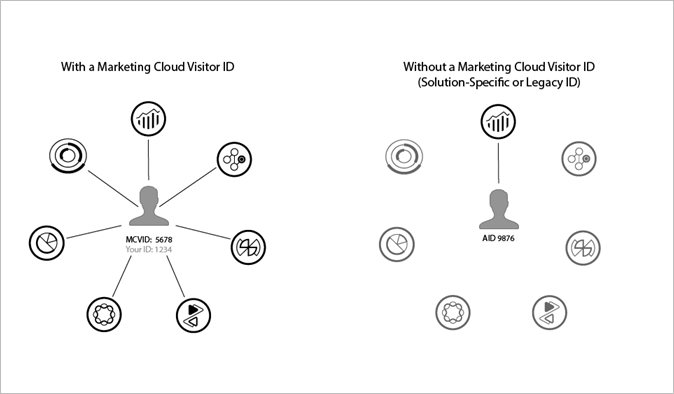

# Prerequisites

## Experience Cloud Enablement (required)

As part of the requirements to implement the Video Heartbeat SDK, you need to implement the Marketing Cloud ID Service (formerly known as Visitor ID Service).

The Marketing Cloud ID service enables the common identification framework for the Marketing Cloud Core Services, solutions, and customer attributes and audiences in the People core service. It works by assigning a unique, persistent ID to a site visitor. When your organization implements the ID service, this ID lets you identify the same site visitor and their data in different Marketing Cloud solutions.

The ID service can also replace the different solution-specific IDs (for example, Analytics AID). Through the [Customer IDs and Authentication States](https://marketing.adobe.com/resources/help/en_US/mcvid/mcvid-authenticated-state.html) functionality, the ID service lets you pass in your own customer IDs to the Marketing Cloud. Keep in mind, however, that the ID service only works with the solutions to which you have already subscribed. If you are not signed up for access to other products, the ID service does not provide the access.

Going forward, the ID service is an integral component of many current and future Marketing Cloud features, enhancements, and services. Currently, the ID service supports [Analytics](http://www.adobe.com/marketing-cloud/web-analytics.html), [Audience Manager](http://www.adobe.com/marketing-cloud/data-management-platform.html), and [Target](http://www.adobe.com/marketing-cloud /testing-targeting.html).

**Important:** To participate in the Adobe Marketing Cloud Device Co-op, the Marketing Cloud ID service required.

If you have not implemented the ID service, now is the time to start considering a migration strategy. For more information about the importance and role of the ID service, see [Why the Marketing Cloud ID Service Should be on Your Radar](http://blogs.adobe.com/digitalmarketing/analytics/why-new-adobe-marketing-cloud-id-service-should-be-on-your-radar/).

**Important:** In the absence of any user ID information present on the video specific calls the default analytics [Fallback ID Methods](https://marketing.adobe.com/resources/help/en_US/sc/implement/visid_fallback.html) will apply.

For more information about the Marketing Cloud ID, see
[Overview](https://marketing.adobe.com/resources/help/en_US/mcvid/mcvid-overview.html).

### Implementation Guides

For more information about implementing the Marketing Cloud ID Service, see [Marketing Cloud ID Service](https://marketing.adobe.com/resources/help/en_US/mcvid/).

## Analytics Enablement (required)

To enable video reports in Analytics and see the video and video ad data you are collecting, see [Video Reports Enablement](add_link.md). 

## Audience Manager Enablement(optional)

Adobe Audience Manager (AAM), a Data Management Platform (DMP), helps you bring your audience data assets together, making it easy to collect commercially relevant information about site visitors, create marketable segments, and serve targeted advertising and content to the right audience.

With AAM, you are not tied to a data seller, exchange, or demand-side platform. Additionally, AAM is completely agnostic when it comes to your partners’ data assets. With access to multiple data sources, AAM offers digital publishers the ability to use a wide variety of third-party data and our private data co-op.

To learn more about AAM, see [Audience Manager Overview](https://marketing.adobe.com/resources/help/en_US/aam/c_am_overview_intro.html).

## Video Heartbeat Data in Audience Manager

For both video content and video ads, the metrics and metadata that are collected by using solution (reserved) variables can be automatically sent to AAM. The data transfer is available across all platforms including desktop, mobile, and OTT. To enable this server-side data transfer, you need to reach out to Adobe Client Care and ask for this feed to be enabled.

Important: To ensure the smooth transfer of data to AAM, you should be on the latest versions of the heartbeat libraries.

Federated Data fully supports data sharing to AAM. Please work with your Adobe team for confirmation of Federated Data settings.

