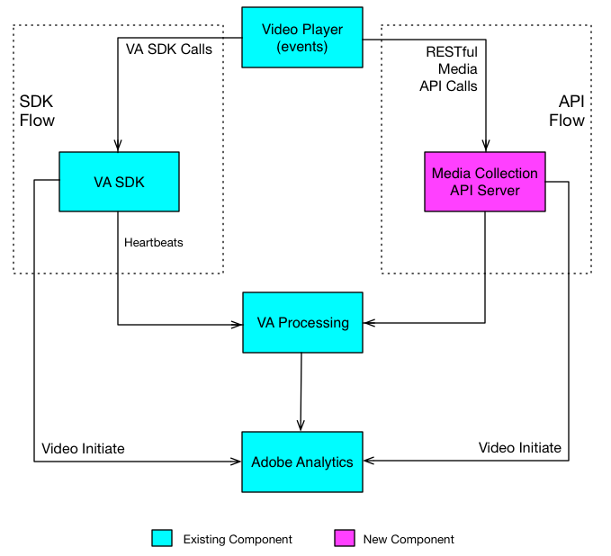

# Media Collection API Implementation


## Introduction {#section_ill_jj3_vbb}

The Media Collection API is Adobe's RESTful alternative to the client-side Video Analytics (VA) SDK. With the Media Collection API your player can track video events using RESTful HTTP calls. 

The Media Collection API is essentially an adapter, acting as a server-side version of the VA SDK. This means that some aspects of the VA SDK documentation (e.g., [ VA SDK 2.x ](https://marketing.adobe.com/resources/help/en_US/sc/appmeasurement/hbvideo/js_2.0/c_vhl_feature-js.html), [ Metrics and Metadata ](https://marketing.adobe.com/resources/help/en_US/sc/appmeasurement/hbvideo/c_vhl_metrics-and-metadata.html)) are also relevant to the Media Collection API. 

## Video Tracking Data Flows {#section_pwq_n34_qbb}


* A video player implementing the Media Collection API makes RESTful API tracking calls directly to the VA back end server, whereas a player implementing the VA SDK makes tracking calls to the SDK APIs inside the app. One effect of making calls over the web is that the player implementing the Media Collection API needs to handle some of the processing that the VA SDK handles automatically. (Details in [](../c_vhl_col-api_overview/mc-api-impl/mc-api-impl.md).)
* The tracking data captured with the Media Collection API is sent and initially processed differently than the tracking data captured in a VA SDK player, but the same VA processing engine on the backend is used for both solutions.


<a id="fig_j5j_pln_pbb"></a>  

## Media Collection API Overview {#section_y4n_mcl_kcb}

**URI: ** Obtain this from your Adobe representative.

**HTTP Method: **POST, with JSON request body.

**API Calls: **


* ** ` sessions` - **Establishes a session with the server, and returns a Session ID used in subsequent ` events` calls. Your app calls this once at the start of a tracking session. 
  ```
  {uri}/api/v1/sessions
  ```

* ** ` events` - **Sends video tracking data. 
  ```
  {uri}/api/v1/sessions/{session-id}/events
  ```


**Request Body: **


```
{ 
    "playerTime": { 
        "playhead": {playhead position in seconds}, 
        "ts": {timestamp in milliseconds} 
    }, 
    "eventType": {event-type}, 
    "params": { 
        {parameter-name}: {parameter-value}, 
        ... 
        {parameter-name}: {parameter-value} 
    }, 
    "qoeData" : { 
        {parameter-name}: {parameter-value}, 
        ... 
        {parameter-name}: {parameter-value} 
    }, 
    "customMetadata": { 
        {parameter-name}: {parameter-value}, 
        ... 
        {parameter-name}: {parameter-value} 
    } 
} 

```


* ` playerTime` - Mandatory for all requests.
* ` eventType` - Mandatory for all requests.
* ` params` - Mandatory for certain ` eventTypes`; check the [ JSON validation schema ](#concept_rlq_nqp_qbb/section_cpy_3xc_mcb) to determine which eventTypes are mandatory, and which are optional.
* ` qoeData` - Optional for all requests.
* ` customMetadata` - Optional for all requests, but only sent with ` sessionStart`, ` adStart`, and ` chapterStart` event types.
For each ` eventType`, there is a publicly available [ JSON validation schema ](#concept_rlq_nqp_qbb/section_cpy_3xc_mcb) that you should use to verify parameter types and whether a parameter is optional or required for a particular event. 

**Event Types: **


* ` sessionStart`
* ` play`
* ` ping`
* ` pauseStart`
* ` bufferStart`
* ` adStart`
* ` adComplete`
* ` adSkip`
* ` adBreakStart`
* ` adBreakComplete`
* ` chapterStart`
* ` chapterSkip`
* ` chapterComplete`
* ` sessionEnd`
* ` sessionComplete`

