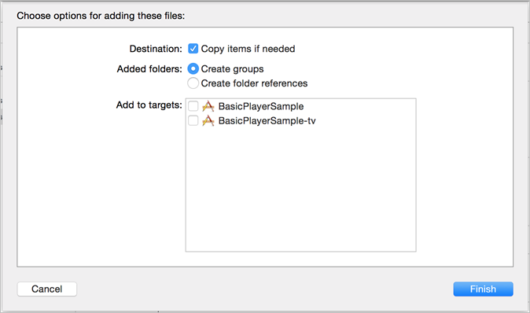
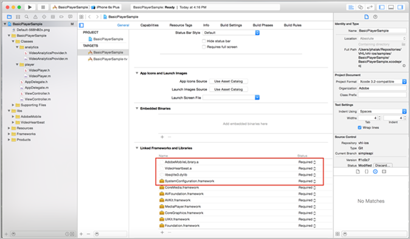

# Set up iOS


* **Obtain valid configuration parameters for Heartbeats** - These parameters can be obtained from an Adobe representative after you set up your video analytics account.
* **Implement ADBMobile for iOS in your application** - For more information about the Adobe Mobile SDK documentation, see [ iOS SDK 4.x for Experience Cloud Solutions ](https://marketing.adobe.com/resources/help/en_US/mobile/ios/). 
  >[!IMPORTANT]
  >
  >Beginning with iOS 9, Apple introduced a feature called App Transport Security (ATS). This feature aims to improve network security by ensuring that your apps use only industry-standard protocols and ciphers. This feature is enabled by default, but you have configuration options that provide you with choices for working with ATS. For details on ATS, see[](https://marketing.adobe.com/resources/help/en_US/mobile/ios/app_transport_security.html). 

* **Provide the following capabilities in your media player:** 
    * *An API to subscribe to player events* - The media heartbeat requires that you call a set of simple APIs when events occur in your player.
    * *An API that provides player information* - This information includes details such as the media name and the play head position.


<<<<<<< HEAD
1. Add your [ downloaded ](../../implement/download-sdks.md#section_551A10AD7880426BB29AE52482BB4211) Heartbeats library to your project.
    
    1. Verify that the following software components exist in the [!DNL  libs] directory:     
        * [!DNL  ADBMediaHeartbeat.h]: The Objective-C header file that is used for iOS video heartbeat tracking APIs.
        * [!DNL  ADBMediaHeartbeatConfig.h]: The Objective-C header file for the SDK configuration.
        * [!DNL  VideoHeartbeat.a]: A bitcode-enabled fat binary that contains the library builds for iOS devices (armv7, armv7s, arm64) and simulators (i386 and x86_64). This binary should be linked when the target is intended for an iOS app. 

        * [!DNL  VideoHeartbeat_TV.a]: A bitcode-enabled fat binary containing the library builds for new Apple TV devices (arm64) and simulator (x86_64). This binary should be linked when the target is intended for an Apple TV (tvOS) app. 

       This library is used with iOS devices and simulators for video heartbeat tracking APIs. 

    1. Add the library to your project:     
        1. Launch the Xcode IDE and open your app.
        1. In **[!UICONTROL  Project Navigator]**, drag the ` libs` directory and drop it under your project.
        1. Ensure that the **[!UICONTROL  Copy Items if Needed]** checkbox is selected, the **[!UICONTROL  Create Groups]** is selected, and none of the checkboxes in **[!UICONTROL  Add to Target]** are selected. <a id="fig_7D00471EC1C6429885025702767E2C10"></a>  

        1. Click **[!UICONTROL  Finish]**.
        1. In **[!UICONTROL  Project Navigator]**, select your app and select your targets.
        1. Link the required frameworks and libraries in the **[!UICONTROL  Linked Frameworks]** and **[!UICONTROL  Libraries]** section on the **[!UICONTROL  General]** tab:         
            * **[!UICONTROL  iOS App Targets]** <a id="fig_4CBCBA481EBB4D539412D33C43BD5AEC"></a>  

            * **[!UICONTROL  Apple TV (tvOS) Target]**: <a id="fig_317077787FB24101A306482E39A80C7D"></a>  
            
                * **[!UICONTROL  AdobeMobileLibrary_TV.a]**
                * **[!UICONTROL  VideoHeartbeat_TV.a]**
                * **[!UICONTROL  libsqlite3.0.tbd]**
                * **[!UICONTROL  SystemConfiguration.framework]**


        1. Verify that your app builds without errors.


    
1. Import the library.

   ```
   #import "ADBMediaHeartbeat.h" 
   #import "ADBMediaHeartbeatConfig.h" 
   
   ```

1. Create a ` ADBMediaHeartbeatConfig` instance.
   This section helps you to understand the ` MediaHeartbeat` config parameters, and to set correct config values on your ` MediaHeartbeat` instance for accurate tracking. 


   Here is a sample ` ADBMediaHeartbeatConfig` initialization: 
   ```
   // Media Heartbeat Initialization 
   ADBMediaHeartbeatConfig *config = [[ADBMediaHeartbeatConfig alloc] init]; 
   config.trackingServer =  
=======
>1. Add your [ downloaded ](../../implement/download-sdks.md#section_551A10AD7880426BB29AE52482BB4211) Heartbeats library to your project.
>    
>    1. Verify that the following software components exist in the [!DNL  libs] directory: >    
>        * [!DNL  ADBMediaHeartbeat.h]: The Objective-C header file that is used for iOS video heartbeat tracking APIs.
>        * [!DNL  ADBMediaHeartbeatConfig.h]: The Objective-C header file for the SDK configuration.
>        * [!DNL  VideoHeartbeat.a]: A bitcode-enabled fat binary that contains the library builds for iOS devices (armv7, armv7s, arm64) and simulators (i386 and x86_64). This binary should be linked when the target is intended for an iOS app. 
>        * [!DNL  VideoHeartbeat_TV.a]: A bitcode-enabled fat binary containing the library builds for new Apple TV devices (arm64) and simulator (x86_64). This binary should be linked when the target is intended for an Apple TV (tvOS) app. 
>       This library is used with iOS devices and simulators for video heartbeat tracking APIs. 
>    1. Add the library to your project: >    
>        1. Launch the Xcode IDE and open your app.
>        1. In **[!UICONTROL  Project Navigator]**, drag the ` libs` directory and drop it under your project.
>        1. Ensure that the **[!UICONTROL  Copy Items if Needed]** checkbox is selected, the **[!UICONTROL  Create Groups]** is selected, and none of the checkboxes in **[!UICONTROL  Add to Target]** are selected. <a id="fig_7D00471EC1C6429885025702767E2C10"></a>  
>        1. Click **[!UICONTROL  Finish]**.
>        1. In **[!UICONTROL  Project Navigator]**, select your app and select your targets.
>        1. Link the required frameworks and libraries in the **[!UICONTROL  Linked Frameworks]** and **[!UICONTROL  Libraries]** section on the **[!UICONTROL  General]** tab: >        
>            * **[!UICONTROL  iOS App Targets]** <a id="fig_4CBCBA481EBB4D539412D33C43BD5AEC"></a>  
>            * **[!UICONTROL  Apple TV (tvOS) Target]**: <a id="fig_317077787FB24101A306482E39A80C7D"></a>  
>            
>                * **[!UICONTROL  AdobeMobileLibrary_TV.a]**
>                * **[!UICONTROL  VideoHeartbeat_TV.a]**
>                * **[!UICONTROL  libsqlite3.0.tbd]**
>                * **[!UICONTROL  SystemConfiguration.framework]**
>        1. Verify that your app builds without errors.
>    
>1. Import the library.
>
>   ```
>   #import "ADBMediaHeartbeat.h" 
>   #import "ADBMediaHeartbeatConfig.h" 
>   
>   ```
>
>1. Create a ` ADBMediaHeartbeatConfig` instance.
>   This section helps you to understand the ` MediaHeartbeat` config parameters, and to set correct config values on your `MediaHeartbeat` instance for accurate tracking. 
>   Here is a sample ` ADBMediaHeartbeatConfig` initialization: >
>   ```
>   // Media Heartbeat Initialization 
>   ADBMediaHeartbeatConfig *config = [[ADBMediaHeartbeatConfig alloc] init]; 
>   config.trackingServer =  
>>>>>>> 0e1bf5d9f46b689ff8b9e4742fa7dfe1371dc048
<i><SAMPLE_HEARTBEAT_TRACKING_SERVER></i>; 
   config.channel        =  
<i><SAMPLE_HEARTBEAT_CHANNEL></i>; 
   config.appVersion     =  
<i><SAMPLE_HEARTBEAT_SDK_VERSION></i>; 
   config.ovp            =  
<i><SAMPLE_HEARTBEAT_OVP_NAME></i>; 
   config.playerName     =  
<i><SAMPLE_PLAYER_NAME></i>; 
   config.ssl            =  
<i><YES/NO></i>; 
   config.debugLogging   =  
<i><YES/NO></i>; 
<<<<<<< HEAD
   
   ```


1. Implement the ` ADBMediaHeartbeatDelegate` protocol.


   ```
   @interface VideoAnalyticsProvider : NSObject <ADBMediaHeartbeatDelegate> 
    
   @end 
    
   @implementation VideoAnalyticsProvider 
    
   // Replace <bitrate>, <startuptime>, <fps> and <droppeFrames>  
   // with the current playback QoS values. 
   - (ADBMediaObject *)getQoSObject { 
       return [ADBMediaHeartbeat createQoSObjectWithBitrate:<bitrate>  
                                 startupTime:<startuptime>   
                                 fps:<fps>  
                                 droppedFrames:<droppedFrames>]; 
   } 
    
   // Return the current video player playhead position. 
   // Replace <currentPlaybackTime> with the video player current playback time 
   - (NSTimeInterval)getCurrentPlaybackTime { 
       return <currentPlaybackTime>; 
   } 
    
   @end 
   
   ```


1. Use the ` ADBMediaHeartBeatConfig` and ` ADBMediaHeartBeatDelegate` to create the ` ADBMediaHeartbeat` instance.

   ```
   //Replace <ADBMediaHeartBeatDelegate> with your delegate instance 
   _mediaHeartbeat = [[ADBMediaHeartbeat alloc] initWithDelegate: 
     <ADBMediaHeartBeatDelegate> config:config];
   ```

   >[!IMPORTANT]
   >
   >Make sure that your ` ADBMediaHeartbeat` instance is accessible and *does not get deallocated until the end of the video session*. This instance will be used for all the following video tracking events. 

=======
>   
>   ```
>
>1. Implement the ` ADBMediaHeartbeatDelegate` protocol.
>
>   ```
>   @interface VideoAnalyticsProvider : NSObject <ADBMediaHeartbeatDelegate> 
>    
>   @end 
>    
>   @implementation VideoAnalyticsProvider 
>    
>   // Replace <bitrate>, <startuptime>, <fps> and <droppeFrames>  
>   // with the current playback QoS values. 
>   - (ADBMediaObject *)getQoSObject { 
>       return [ADBMediaHeartbeat createQoSObjectWithBitrate:<bitrate>  
>                                 startupTime:<startuptime>   
>                                 fps:<fps>  
>                                 droppedFrames:<droppedFrames>]; 
>   } 
>    
>   // Return the current video player playhead position. 
>   // Replace <currentPlaybackTime> with the video player current playback time 
>   - (NSTimeInterval)getCurrentPlaybackTime { 
>       return <currentPlaybackTime>; 
>   } 
>    
>   @end 
>   
>   ```
>
>1. Use the ` ADBMediaHeartBeatConfig` and ` ADBMediaHeartBeatDelegate` to create the ` ADBMediaHeartbeat` instance.
>
>   ```
>   //Replace <ADBMediaHeartBeatDelegate> with your delegate instance 
>   _mediaHeartbeat = [[ADBMediaHeartbeat alloc] initWithDelegate: 
>     <ADBMediaHeartBeatDelegate> config:config];
>   ```
>   >[!IMPORTANT]
>   >
>   >Make sure that your ` ADBMediaHeartbeat` instance is accessible and *does not get deallocated until the end of the video session*. This instance will be used for all the following video tracking events. 
>
>>>>>>> 0e1bf5d9f46b689ff8b9e4742fa7dfe1371dc048
