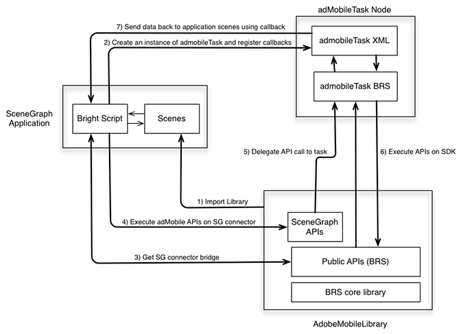

# Architecture

To add SceneGraph support to the AdobeMobile SDK, Adobe has added a new API that creates a connector bridge between the AdobeMobile SDK and ` adbmobileTask`. The latter is a SceneGraph node used for the SDK's API execution. (Usage of ` adbmobileTask` is explained in detail throughout the rest of this document.) 

The connector bridge is designed to perform as follows:

* The bridge returns a SceneGraph-compatible instance of the AdobeMobile SDK. The SceneGraph-compatible SDK has all of the APIs that the legacy SDK exposes.
* You use the AdobeMobile SDK APIs in SceneGraph in a very similar way to how you used the legacy APIs.
* The bridge also exposes a mechanism to listen for callbacks for APIs that return some data.

  

## COMPONENTS {#section_jwl_wqx_1bb}

**SceneGraph Application:**

* Consumes ` AdobeMobileLibrary` APIs via the SceneGraph connector bridge APIs.
* Registers for response callbacks on ` adbmobileTask` for expected output data variables.
**AdobeMobileLibrary:**

* Exposes a set of public APIs (Legacy), including the connector bridge API.
* Returns a SceneGraph connector instance that wraps all legacy public APIs.
* Communicates with an ` adbmobileTask` SceneGraph node for execution of APIs.
**adbmobileTask Node:**

* A SceneGraph task node that executes ` AdobeMobileLibrary` APIs on a background thread.
* Serves as a delegate to return data back to application scenes.

