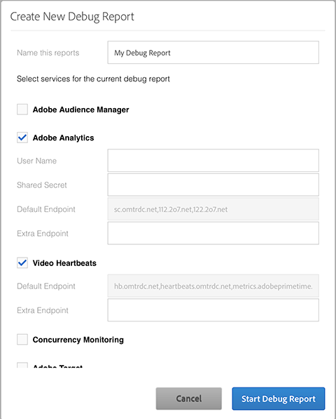

# Create a New Debug Report

To create a new Debug report: 

1. In **Create a New Debug Report**, select the following:   

1. Complete the fields with the following information: 
    * **Name the Report** - Enter the player name and date so that you can easily track the player during certification and keep brands and platforms separate.
    * **Adobe Analytics** 
        * **User Name** and **Shared Secret** - These fields are optional, but you can add your web services API credentials to Adobe Debug to display the variable names and variable settings for the report suite. You can access in one of the following ways:         
            * **Analytics &amp;gt; Admin &amp;gt; Company Settings &amp;gt; Web Services**
            * **Analytics &amp;gt; Admin &amp;gt; User Management &amp;gt; Users &amp;gt; Individual User Settings** To create a web services API credential for a new user, in **User Management**, add the user to the **Web Service Access** user group. 

        * **Default Endpoint** - The data in this field is provided by Adobe and cannot be changed.
        * **Extra Endpoint** - Add ` CNAMES`, if you use them, for tracking server like ` metrics.companyname.com`

    * **Video Heartbeats** 
        * **Default Endpoint** - The data in this field is provided by Adobe and cannot be changed.
        * **Extra Endpoint** - Add ` CNAMES`, if you use them, for tracking server like ` metrics.companyname.com`.

    * **Nielsen DCR** 
        * **Default Endpoint** - The data in this field is provided by Adobe and cannot be changed.
        * **Extra Endpoint**

