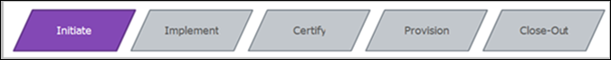
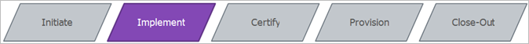
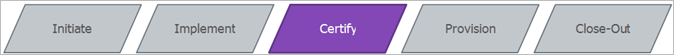
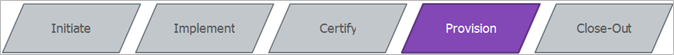

# Certification Process Summary

## Full Certification Criteria {#section_0BFC4F2C34364621AA1A26410731D45E}

* First Time Certifications: 
    * The first time a video player within an app or site is tagged with the Joint Adobe/Nielsen SDK a full certification is required.
    * Each video player within a site or app requires a separate certification.

* Re-Certifications: 
    * If significant changes are made to the video player within an app or site (such as changing video player providers or changing ad services), a full certification is required.

## Self Certification Criteria {#section_0206A312318D499BA0E5FE0A06615829}

Here are the criteria for self-certification: 

* When the Adobe Video Analytics SDK is updated a self certification is required.
* If another Brand, within the same company, leverages the same player implementation and the player is simply "re-skinned", a self certification is required.

  

<table id="table_9CA49981020E4D2997424C9F6C92D6A4"> 
 <thead> 
  <tr> 
   <th colname="col1" class="entry"> Full Certification </th> 
   <th colname="col2" class="entry"> Self Certification </th> 
  </tr>
 </thead>
 <tbody> 
  <tr> 
   <td colname="col1"> 
<b>Key Actions</b> 
     <ul id="ul_43B063DC14EE44DDB07F8A948FC84005"> 
      <li id="li_9992D0B7F27840559CB59EDC58DFD1FD">Client signs data-sharing addendum. </li> 
      <li id="li_D5CDD711ABB043539E632AA5581F2F6D">Client sends list of email addresses for access to Adobe Debug and Zendesk. </li> 
      <li id="li_E93C24E8DC31455194E1E05EF81F50AB">Schedule and host kick-off call. </li> 
      <li id="li_B6E8B747F35F4431B45D619625DC1495">Create first Zendesk ticket. </li> 
     </ul> 
 </td> 
   <td colname="col2" align="left" valign="top"> 
<b>Key Actions </b> 
     <ul id="ul_0C02950A43704A678E82DE79CB37EDB4"> 
      <li id="li_D28CB4BB691A41A189B27AE7B8C169BD">Client signs data-sharing addendum. </li> 
      <li id="li_194A5585514B474FBF476CA1468E9B10">Adobe, Nielsen, and Client schedule and host kick-off call. </li> 
      <li id="li_D7E8B01D50CD43CCB4748E9424004794">Register users for Adobe Debug and Zendesk. </li> 
     </ul> 
 </td> 
  </tr> 
  <tr> 
   <td colname="col1"> 
<b>Key Deliverables</b> 
     <ul id="ul_B23C2CB7C1BB48D7A70F2DD1888CE26F"> 
      <li id="li_FD54D670941641A8B799BBAE94F9871C">The signed data-sharing addendum is delivered to Adobe and Nielsen. </li> 
      <li id="li_15D79B181759488498B95CF044698803">Users have access to Adobe Debug and Zendesk. </li> 
      <li id="li_07A41CFE8DE947BC873CCE8AB4BAC9AA">A copy of the kick-off slide deck is delivered to the Client. </li> 
     </ul> 
 </td> 
   <td colname="col2" valign="top"> 
<b>Key Deliverables</b> 
 
None.
 </td> 
  </tr> 
  <tr> 
   <td colname="col1"> 
<b>Estimated Time</b> 
 
 
     <ul id="ul_893DE4BD26A044EAB0A6FFC07FE86639"> 
      <li id="li_03C4223DEED747A8B6B08C334024A9AD">1 week </li> 
     </ul> 
 </td> 
   <td colname="col2" valign="top"> 
<b>Estimated Time</b> 
 
 
     <ul id="ul_3F0370E740104FFCA0E8AF0DC7AFD67C"> 
      <li id="li_DAD0D45DC4524D6DA0CBA7D5143DB56B">1 day </li> 
     </ul> 
 </td> 
  </tr> 
  <tr> 
   <td colname="col1"> 
<b>Led By</b> 
 
 
     <ul id="ul_FDA188520D7C4FDD91E3F033DCDCA587"> 
      <li id="li_199D5634017F4D20A29481ED0A08D2D6">Adobe </li> 
     </ul> 
 </td> 
   <td colname="col2" valign="top"> 
<b>Led By</b> 
 
 
     <ul id="ul_50528506EEDC4184B0E2ECD304217A05"> 
      <li id="li_6E6C292044894C6E955335B999F73DA7">Adobe </li> 
     </ul> 
 </td> 
  </tr> 
 </tbody> 
</table>

  

<table id="table_64B9E82D590540C1A67DEBDE14168B32"> 
 <thead> 
  <tr> 
   <th colname="col1" class="entry"> Full Certification </th> 
   <th colname="col2" class="entry"> Self Certification </th> 
  </tr>
 </thead>
 <tbody> 
  <tr> 
   <td colname="col1"> 
<b>Key Actions</b> 
 
 
     <ul id="ul_1233BF75999A454EBE785C6EEA23791D"> 
      <li id="li_068AC467380949968DB3D55B20A8B2B6">Client development team implements the Joint Adobe/Nielsen SDK for players. </li> 
      <li id="li_68AC75A65BB74AA4995B898AD0F322EB">Client validates tracking calls using test case scenarios and validation guide. </li> 
     </ul> 
 </td> 
   <td colname="col2" align="left" valign="top"> 
<b>Key Actions</b> 
 
 
     <ul id="ul_42483F40E8DD4624BE640604BD3CEEFA"> 
      <li id="li_5CCE30CC6A5C4A8FBDC62DCBA4AD7253">The Client developer validates the implementation scenarios by ensuring that they pass all of the test scenarios. </li> 
     </ul> 
 </td> 
  </tr> 
  <tr> 
   <td colname="col1"> 
<b>Key Deliverables</b> 
 
 
     <ul id="ul_FDE077B042E24E6B970D53D07CB2AC39"> 
      <li id="li_93F9E3A28E7C43A1BA01F55A18F21EC6">Client completes and validates the implementation. </li> 
     </ul> 
 </td> 
   <td colname="col2" valign="top"> 
<b>Key Deliverables</b> 
 
None. 
 </td> 
  </tr> 
  <tr> 
   <td colname="col1"> 
<b>Estimated Time</b> 
 
 
     <ul id="ul_9C9121341B7842B5BA7976E6A6881D67"> 
      <li id="li_3A583E8CCA7D4223A0F4774123B733A5"> 3 weeks </li> 
     </ul> 
 </td> 
   <td colname="col2" valign="top"> 
<b>Estimated Time</b> 
 
 
     <ul id="ul_351AE8BC49B14C579A2B1A689B9E78E8"> 
      <li id="li_4AD6635505F14338A6198A9EA8321803">1 week </li> 
     </ul> 
 </td> 
  </tr> 
  <tr> 
   <td colname="col1"> 
<b>Led By</b> 
 
 
     <ul id="ul_227657435CBC4EFB92814FD86C440F57"> 
      <li id="li_5BF2681D6D964CAEB062A8BDFA0D2FFB">Client </li> 
     </ul> 
 </td> 
   <td colname="col2" valign="top"> 
<b>Led By</b> 
 
 
     <ul id="ul_5A0F44992F9E433AAA81446CEC2D3A37"> 
      <li id="li_950CA4DF4BBA44EBAD2153E687A29FD6">Client </li> 
     </ul> 
 </td> 
  </tr> 
 </tbody> 
</table>

  

<table id="table_1DB78E21FD03489DA40D21E7FD646AA4"> 
 <thead> 
  <tr> 
   <th colname="col1" class="entry"> Full Certification </th> 
   <th colname="col2" class="entry"> Self Certification </th> 
  </tr>
 </thead>
 <tbody> 
  <tr> 
   <td colname="col1"> 
<b>Key Actions</b> 
 
 
     <ul id="ul_7CD3777862614521AFCDA8466D1A8ED2"> 
      <li id="li_8F4DCC8E733F48CE92F002B3A7C26DC8">Client submits certification request form to Zendesk. 
The submission includes the following information: 

 
        <ul id="ul_246544E91670433B821FE8FE3A549791"> 
         <li id="li_2CB99FA61B0F45C098717277113BF4E6">Adobe Debug logs for test cases. </li> 
         <li id="li_EF899031BBB6424EA2BED15A2FDE4F72">Instructions for access to the site or app. </li> 
        </ul> 
 </li> 
      <li id="li_5B5C47529D2A498A9E13B920D6D0CE20">Adobe and Nielsen teams validate the implementation. </li> 
      <li id="li_0A20BBAA156E4E95A93F07676BCF4C6B">Provide feedback on blockers or warnings that were found. </li> 
      <li id="li_35AF372277344CB0BAFF1AEE5AA208A9">Certify site or app after all of the validation criteria are met. </li> 
     </ul> 
 </td> 
   <td colname="col2" align="left" valign="top"> 
<b>Key Actions</b> 
 
 
     <ul id="ul_5F882D4AE3DD41D38A7A45D07190F4C1"> 
      <li id="li_EFE70E4532794E7B9865785B6B97345C">Client submits the Self Certification form and Adobe Debug logs to the Zendesk ticket. </li> 
      <li id="li_43481EDC47F54C97A962D1080A73C5A3">Adobe and Nielsen teams review the Adobe Debug logs. </li> 
     </ul> 
 </td> 
  </tr> 
  <tr> 
   <td colname="col1"> 
<b>Key Deliverables</b> 
 
 
     <ul id="ul_9AB5E696C5224C8CB1CD64A1252A14C7"> 
      <li id="li_9782F5BD9AD0451E9920F4F94B558DA5">Certification Request Form is submitted to Zendesk. </li> 
      <li id="li_F7DF72C5D0C8434D897CD893FC08A08C">Certification approval submitted by Adobe and Nielsen. </li> 
     </ul> 
 </td> 
   <td colname="col2" valign="top"> 
<b>Key Deliverables</b> 
 
None.
 </td> 
  </tr> 
  <tr> 
   <td colname="col1"> 
<b>Estimated Time</b> 
 
 
     <ul id="ul_77548C746C194AC88A179EEA43FD3BF7"> 
      <li id="li_722E51027E844BF695F5493B410BEE15">1 week </li> 
     </ul> 
 
Note: All failed certifications (those with blockers) are required to start the <b>Certify</b> step again, including the timelines and deliverables. 
 </td> 
   <td colname="col2" valign="top"> 
<b>Estimated Time</b> 
 
 
     <ul id="ul_609528A648F44C75BEE57BC3A2D390D1"> 
      <li id="li_52156054898840499FDC2E7939E57B43">1 week </li> 
     </ul> 
 </td> 
  </tr> 
  <tr> 
   <td colname="col1"> 
<b>Led By</b> 
 
 
     <ul id="ul_B0431ED82C24435198ECC75C66177021"> 
      <li id="li_28344DD0D4BB42859CDF2582A4F1EF5D">Adobe and Nielsen </li> 
     </ul> 
 </td> 
   <td colname="col2" valign="top"> 
<b>Led By</b> 
 
 
     <ul id="ul_F577426241724F5B95FB38C5182B366A"> 
      <li id="li_7C5FA0C0A6BE47FC8250138F4F45AAF1">Adobe and Nielsen </li> 
     </ul> 
 </td> 
  </tr> 
 </tbody> 
</table>

  

<table id="table_75780058B85B4EF991273597DE5355F2"> 
 <thead> 
  <tr> 
   <th colname="col1" class="entry"> Full Certification </th> 
   <th colname="col2" class="entry"> Self Certification </th> 
  </tr>
 </thead>
 <tbody> 
  <tr> 
   <td colname="col1"> 
<b>Key Actions</b> 
 
 
     <ul id="ul_6648074604734021890AA7889E8643D0"> 
      <li id="li_2BF56DDA6EB04F0AB531D7E87D984BD2">The Adobe consultant submits the data-sharing provisioning request to the Adobe provisioning team. </li> 
      <li id="li_41D9E324EB524E73AB5D92FDB602E970">Nielsen confirms that the data is being shared. </li> 
     </ul> 
 </td> 
   <td colname="col2" align="left" valign="top"> 
<b>Key Actions</b> 
 
 
     <ul id="ul_07B9700D19CB484E85D66548BF33ECE7"> 
      <li id="li_ECD90C9CF9404CD195E996E98CCB4F7F">Adobe provisions report suite for data sharing. </li> 
      <li id="li_D2287781D4A1492F9ED1A0FA02398E0A">Nielsen validates that the data was received. </li> 
     </ul> 
 </td> 
  </tr> 
  <tr> 
   <td colname="col1"> 
<b>Key Deliverables</b> 
 
 
     <ul id="ul_64AFB83BE8204D138C51DF8D28DF0DB6"> 
      <li id="li_C0D4F86CB46D48648A2BB3C553A61EB7">A status update is made to the Zendesk ticket. </li> 
     </ul> 
 </td> 
   <td colname="col2" valign="top"> 
<b>Key Deliverables</b> 
 
None.
 </td> 
  </tr> 
  <tr> 
   <td colname="col1"> 
<b>Estimated Time</b> 
 
 
     <ul id="ul_0EDE30F6C8D443F992007CAA9316F14E"> 
      <li id="li_319A688E732F4BA89F440D7E73B4E6DD">1 week </li> 
     </ul> 
 </td> 
   <td colname="col2" valign="top"> 
<b>Estimated Time</b> 
 
 
     <ul id="ul_6A1A83574AED495DB75BB5B681536DB6"> 
      <li id="li_654B8B0C4E5445A5BF1F23928C8348E8">1 week </li> 
     </ul> 
 </td> 
  </tr> 
  <tr> 
   <td colname="col1"> 
<b>Led By</b> 
 
 
     <ul id="ul_C695FC35CD9E4E5D9C9AC9393EA157B4"> 
      <li id="li_FEE5AF87B6B54C4A88493ED3537472FB">Adobe </li> 
     </ul> 
 </td> 
   <td colname="col2" valign="top"> 
<b>Led By</b> 
 
 
     <ul id="ul_C5873FEC27534B36ACFA028E09B9BD88"> 
      <li id="li_FDE2BE06B05641A9BC879088F84412A2">Adobe </li> 
     </ul> 
 </td> 
  </tr> 
 </tbody> 
</table>

  

<table id="table_541A031A3A0B447E969195E6C259FB82"> 
 <thead> 
  <tr> 
   <th colname="col1" class="entry"> Full Certification </th> 
   <th colname="col2" class="entry"> Self Certification </th> 
  </tr>
 </thead>
 <tbody> 
  <tr> 
   <td colname="col1"> 
<b>Key Actions</b> 
 
 
     <ul id="ul_2B02634C22D14D3C971DD60CD32DD68D"> 
      <li id="li_327ED3763CFD450AB2EB61F9BC8DB94D">The final review of all of the steps and the ticket. </li> 
     </ul> 
 </td> 
   <td colname="col2" align="left" valign="top"> 
<b>Key Actions</b> 
 
 
     <ul id="ul_11C5EC8C92B945EEB14E23209B892221"> 
      <li id="li_F0E88870B1794F5D896C570097ECAD0B">Final status is posted to Zendesk and the ticket is closed. </li> 
     </ul> 
 </td> 
  </tr> 
  <tr> 
   <td colname="col1"> 
<b>Key Deliverables</b> 
 
 
     <ul id="ul_80A9520EA7C644A4AA46E8B708D6817A"> 
      <li id="li_8296CC8BDB1146178A32D75A8579F8BC">Close out the Zendesk ticket as complete. </li> 
     </ul> 
 </td> 
   <td colname="col2" valign="top"> 
<b>Key Deliverables</b> 
 
None.
 </td> 
  </tr> 
  <tr> 
   <td colname="col1"> 
<b>Estimated Time</b> 
 
 
     <ul id="ul_9D8B13CD50B940AC8E5311D3EB29A893"> 
      <li id="li_57DE785CC4A6493A84D41D9BD89D38AF">1 day </li> 
     </ul> 
 </td> 
   <td colname="col2" valign="top"> 
<b>Estimated Time</b> 
 
 
     <ul id="ul_0620CC125C78401EB5D468F6DAA1835D"> 
      <li id="li_09C7F492467C4974BD66D2527D77D4D5">1 week </li> 
     </ul> 
 </td> 
  </tr> 
  <tr> 
   <td colname="col1"> 
<b>Led By</b> 
 
 
     <ul id="ul_5C0248BC79334BD2ACD90D4A9EC26365"> 
      <li id="li_26C67F04755548D2B45F5D17A7DFB539">Adobe </li> 
     </ul> 
 </td> 
   <td colname="col2" valign="top"> 
<b>Led By</b> 
 
 
     <ul id="ul_685CB0F319354DA4AF18BFE2C82AA2ED"> 
      <li id="li_AD1B91CCA1C8469E91FC4D2EFF010311">Adobe </li> 
     </ul> 
 </td> 
  </tr> 
 </tbody> 
</table>

