# Data Comparison

This topic contains the following information: 

* [ Data Characteristics](../../../nielsen-partnership/c_dcr_certification/c_dcr_cert_validation/c_dcr_data_compare.md#section_CF116B74BB7F47C1AD7110D4C3511E67)
* [ Adobe/Nielsen Data](../../../nielsen-partnership/c_dcr_certification/c_dcr_cert_validation/c_dcr_data_compare.md#section_FA4BB3E4E5CC4EF08E391B5F5B6B9EB7)
* [ Nielsen DCR Data](../../../nielsen-partnership/c_dcr_certification/c_dcr_cert_validation/c_dcr_data_compare.md#section_48213E18F54A47A2A09BD7F886598C8A)
* [ Troubleshooting](../../../nielsen-partnership/c_dcr_certification/c_dcr_cert_validation/c_dcr_data_compare.md#section_51C986B1CDAC4C999EF8426ACC57687C)

## Data Characteristics {#section_CF116B74BB7F47C1AD7110D4C3511E67}

>[!IMPORTANT]
>
>You should only compare Adobe Video Analytics Nielsen data and Nielsen Digital Content Ratings (DCR) data, not DTVR or static data.

The data being compared should only include: 

* US traffic 

* Content consumption with a dynamic ad load, not linear ads 

* The day definition is 6AM to 6AM EST 

* The week definition is Monday to Sunday 

## Adobe/Nielsen Data {#section_FA4BB3E4E5CC4EF08E391B5F5B6B9EB7}

To view the corresponding Nielsen data in Adobe Analytics: 

1. Create a Nielsen segment. In the report suite that collects Nielsen data, create a segment that is defined in the following way: 

    * **[!UICONTROL  Nielsen Client ID exists]**. 

    * **[!UICONTROL  Countries equals United States]**. 

    * **[!UICONTROL  Ad Loads does not equal 1]**. 

    * **[!UICONTROL  Content Start is greater than or equal to 1]** or **[!UICONTROL  Content Time is greater than or equal to 1]**. 

    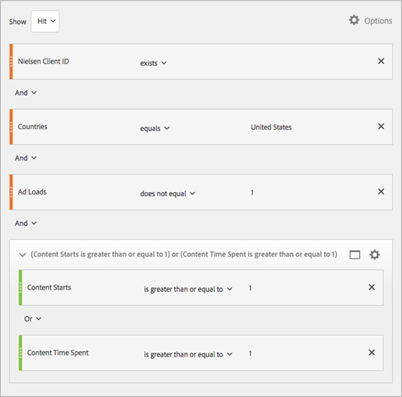 

1. Create Nielsen computer/mobile segments by creating the following segments: 

    * **[!UICONTROL  Nielsen Computer]** 

      This segment should have a rule of **Mobile Device Type equals Other**. 

       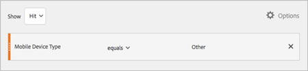 

    * **[!UICONTROL  Nielsen Mobile]** 

      This segment should have a rule of **Mobile Device Type does not equal Other**. 

   These segments can be used to match the numbers that Nielsen reports as Computer or Mobile. Without these segments, the numbers represent the full **Digital (C/M)** numbers. 

1. Create a Freeform table. 

   Apply the Nielsen segment and the mobile, **or** the computer segment, that you created in steps 1 and 2 to a new report that uses the following Nielsen variables: 

    * Nielsen Asset/Program
    * Nielsen Segment A

   Apply the following metrics: 

    * Content Starts 

    * Content Time Spent Minutes 

      You might need to create this metric as a new metric that is calculated by dividing the Content Time Spent metric by 60. 

1. Create a virtual report suite. 

   For ongoing analysis, create a virtual report suite to correct for the time zone difference. The Nielsen data for a day covers 6 AM to 6 AM EST/EDT, which will not match the time zone that is configured for your report suite.  By creating a virtual report suite, you can match the Nielsen time zone by using **[!UICONTROL  US Hawaii [GMT-10:00]]** from the first Sunday in March until the first Sunday in November and **[!UICONTROL  Midway Island, Samoa [GMT-11:00]]** from the first Sunday in November until the first Sunday in March. 

   The custom visitor segment noted above can also be applied during the creation of the virtual report suite, which limits the data in the virtual report suite to only Nielsen data. 

    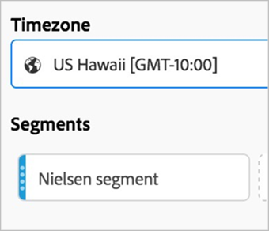 

   For more information about creating a virtual report suite, see [ Creating Virtual Report Suites](https://marketing.adobe.com/resources/help/en_US/reference/vrs-create.html). 

## Nielsen DCR Data {#section_48213E18F54A47A2A09BD7F886598C8A}

Here is some general information about Digital Content Ratings. 

Digital Content Ratings does not include any of the following: 

* Content consumption with a linear ad load 

* Non-US traffic 

* General Invalid Traffic (IP and threshold-based filtration) 

The day definition is 6AM to 6AM EST, and the week definition is Monday to Sunday. 

Nielsen calculates Unique Audience as unique people as defined by our data provider, as opposed to cookies or device-based classification of uniques. 

**Pulling Data in DCR Report Builder** 

 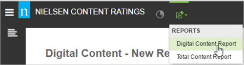 

* **Content Type:** Video 

   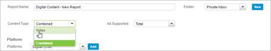 

* **Ad Supported:** Total 

* **Platform:** Ensure that platforms are consistent across Nielsen and Adobe. 

   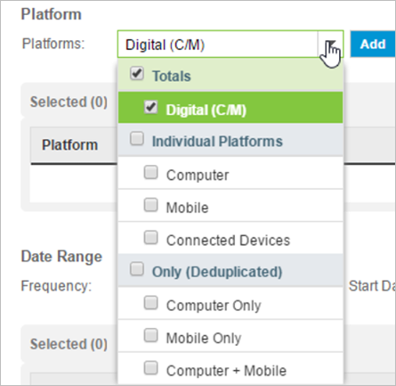 

* **Digital (C/M):** Includes computer and mobile data across browser and app. 

* **Mobile:** Includes smartphone and tablet data across mobile browser and app 

* **Computer:** Includes desktops and laptops for browser 

  >[!IMPORTANT]
  >
  >Do not leverage Connected Devices or any platforms listed under the **[!UICONTROL  Only (Deduplicated]**) option. 

* ** Date Range:** Ensure frequency aligns and that you consider that the day definition discrepancies will be especially apparent for daily data and for shows that air on week boundaries 

   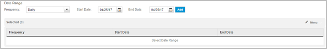 

* **Demographics:** Ensure that you select **Persons 2+** so that all impressions, including ones with unknown demographics, are accounted for. 

   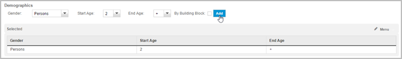 

* **Entities:** Select relevant entities 

  >[!TIP]
  >
  >You can select the highest entity for example, Brand level) and pull in lower reporting levels in the **[!UICONTROL  Layouts]** section. 

    

* **Metrics** 

  The following metrics are used for comparison: 

    * Views 

    * Total time spent 

       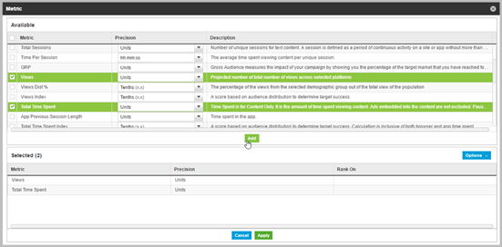 

* **Layouts ** 

    * **Entities:** Hierarchy 

      Pull in the lowest level for which you would like data, Episode/Segment A, and all higher levels, will be automatically added. 

       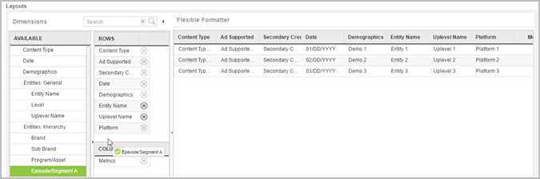 

    * **Other Selections** 

      If your Adobe report suites are split up by any of the following dimensions, include the relevant selections to facilitate the analysis: 

    
        * **Device**, such as a smartphone or tablet. 

        * **Operating System**, such as iOS or Android. 

        * **Access Method**, such as a browser or an app. 

 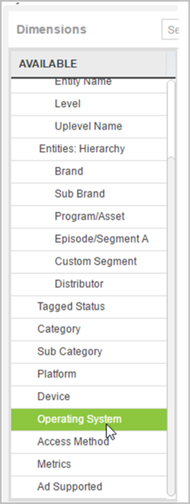 

## Troubleshooting {#section_51C986B1CDAC4C999EF8426ACC57687C}

If the data does not align within 2%, check the following again: 

* Adobe Data

    * The correct report suite is being used. 

    * The segment is Hit-based and is utilizing the definition above. 

    * The date range is correct. 

* Nielsen Data 

    * The platform selection is correct. 

    * the Access Method is taken into account (for example, if your browser report suite includes mobile browser, add **[!UICONTROL  Mobile Browser]** traffic to **[!UICONTROL  Computer traffic]** on the Nielsen side. 

    * The proper content type and metrics are selected. 

If these items are all correct and the data is still not aligned, contact your Nielsen and Adobe contacts for additional reviews. 
