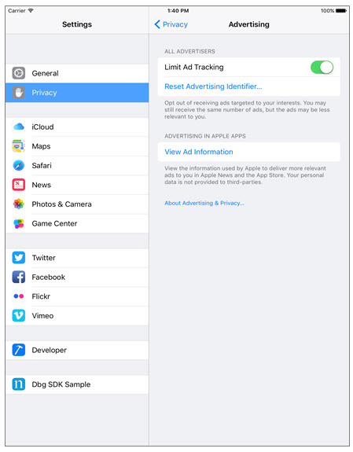
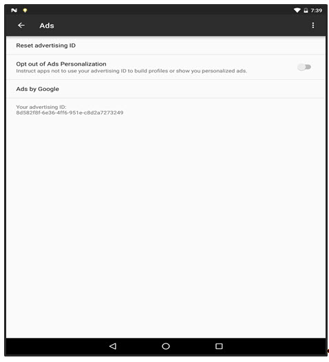
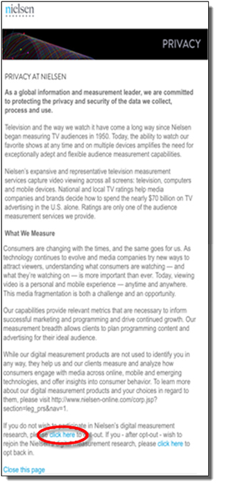
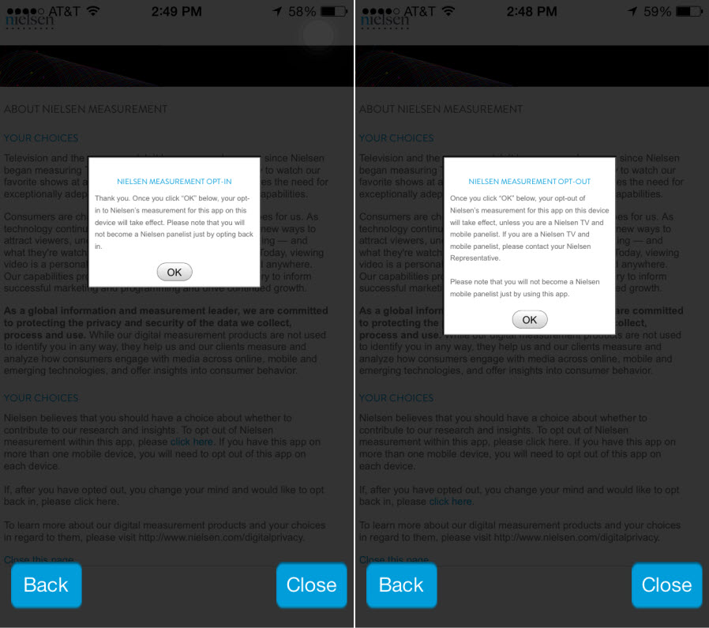
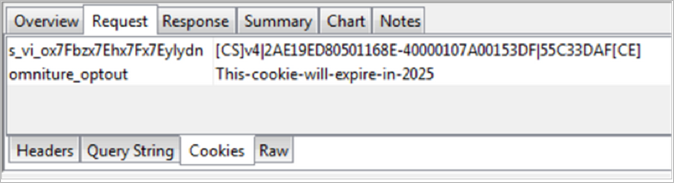

# Test 3: Opt-out Nielsen

Download the certification request form here: . 

## Validation {#section_6596F19AC854443B8624A264ECE020FE}

>[!IMPORTANT]
>
>Click[ Test 3: Opt-Out Nielsen ](test_3_opt-out_nielsen_video_valid_guide.pdf) to download the complete details about this test case. 

You must complete and record these tasks in the following order: 

1. **Activate Opt-out.**
    * **VA (Heartbeats) SDK Version 2.1** 
        * **iOS Apps**Opt-out and Opt-in are set by the user in the device's *Privacy Settings*, under *Advertising*. To opt-out, set *Limit Ad Tracking* on; to opt-in, set *Limit Ad Tracking* off.

            

        * **Android Apps** 
            * **Nielsen SDK Version 5.1.1.18 and up**
            * To opt out, use the *Ads* settings on the device: *Google Settings → Ads → Opt out of Ads Personalization:*
            

    * **VA (Heartbeats) SDK Version 2.0 and earlier**When you click the Opt-Out/Opt-In link in the app, the application should invoke [ optOutURL ](https://engineeringportal.nielsen.com/docs/optOutURL) to get the link to the Nielsen Privacy page from the SDK. Verify that the Nielsen Opt-in/Opt-out Privacy page gets displayed properly in a window on the device.

      Click the opt-out link on the Privacy page to opt out of Nielsen tracking, and click OK on the ensuing dialog:

        

        

   **Browser Apps:**Find and click the opt-out link to opt out of Nielsen tracking.

   Verify that the current Nielsen Opt-in/Opt-out Privacy page is displayed properly in a window on the device. 

   For implementation details, see the Opt-Out section in .

   After clicking the Nielsen opt-out, one Goodbye call is sent to Nielsen. Once the Goodbye call is sent, no additional network calls should be sent to Nielsen. 

1. **Start the video player.****Browser** 

   When the video starts an Adobe Analytics Content Start call with an Opt-out cookie.If you examine the cookies sent on a request, you will see one named omniture_optout. 

     

   **Mobile App** 

   In mobile apps, no data is collected after the user has opted out*. You should not see any Adobe Analytics or Heartbeat network traffic after opting out of Adobe tracking. 

   >[!NOTE]
   >
   >*For API Version 5.1 and above, the App SDK will fire data pings and continue measurement even after the user has opted out from Nielsen measurement on a device. The data ping will be marked as opted-out ping.

1. **View ad playback.****Browser** 

     

   **Mobile App** 

   In mobile apps, no data is collected after the user has opted out*. You should not see any Adobe Analytics or Heartbeat network traffic after opting out of Adobe tracking. 

   >[!NOTE]
   >
   >*For API Version 5.1 and above, the App SDK will fire data pings and continue measurement even after the user has opted out from Nielsen measurement on a device. The data ping will be marked as opted-out ping.

1. **Play video for at least 10 minutes, uninterrupted. **No Adobe or Nielsen tracking calls should be sent during video playback. 

1. **Find and click the opt-in link to opt in to Nielsen tracking**Verify that the current Nielsen Opt-in/Opt-out URL page is displayed properly in a window on the device. 

   Click the opt-in option. 

1. **Start the video player.**When the video player starts, the following calls are sent in the following order: 

    1. Video analytics start*
    1. Heartbeat start*
    1. Heartbeat analytics start
    1. Nielsen DCR start

   *These calls contain additional metadata and Nielsen variables. For call parameters and metadata, see  in *Test Call Details*.

1. **View ad playback.****Ad Start** 

   On start of a video ad, four key calls are sent in the following order: 

    1. Video ad analytics start*
    1. Heartbeat ad start*
    1. Heartbeat ad analytics start
    1. Nielsen DCR ad start

   *These calls contain additional metadata and Nielsen variables. For call parameters and metadata, see  in *Test Call Details*.

1. **Play main content video for at least 10 minutes uninterrupted. **During regular main content playback, Heartbeat calls are sent to the Heartbeat server every ten seconds. Nielsen calls are sent to the Nielsen server every five minutes. 

   For call parameters and metadata, see  in *Test Call Details*

1. **Close the video player.**The last Nielsen DCR duration ping is sent, and no additional tracking calls should fire after video player is closed. 

