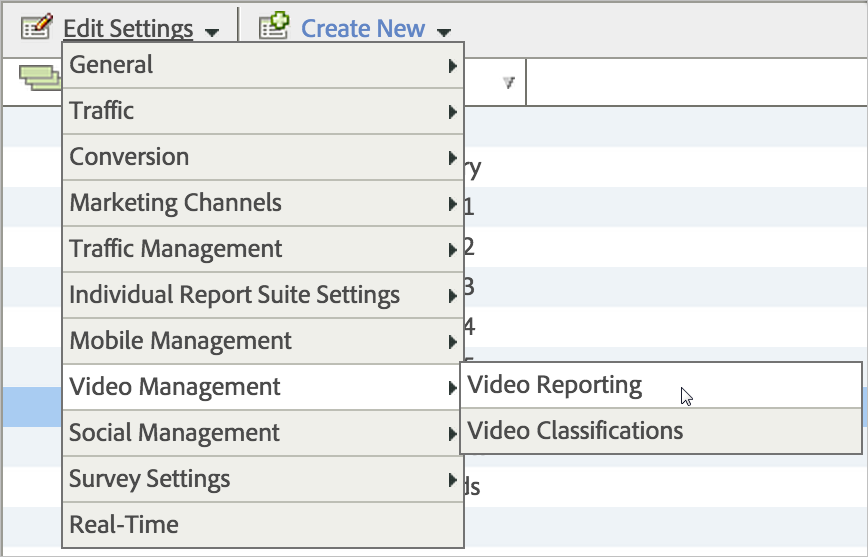

# Nielsen Hierarchy

The table below shows the hierarchy levels for video content. When syndicated reporting is rolled out, the first 4 levels will be syndicated for video content. 

<table id="table_D38F60EEA4C64D1FB293C00369CB24BE"> 
 <thead> 
  <tr> 
   <th colname="col1" class="entry"> Level </th> 
   <th colname="col2" class="entry"> Tag Parameter </th> 
   <th colname="col3" class="entry"> Description </th> 
   <th colname="col4" class="entry"> Supplier </th> 
  </tr> 
 </thead>
 <tbody> 
  <tr> 
   <td colname="col1"> 
Brand 
 </td> 
   <td colname="col2"> 
(Not included in the tag) 
 </td> 
   <td colname="col3"> 
Brand is determined by a combination of the client ID (parent) and sub-brand ( vcid) 
 </td> 
   <td colname="col4"> 
Nielsen 
 </td> 
  </tr> 
  <tr> 
   <td colname="col1"> 
Sub-brand 
 </td> 
   <td colname="col2"> 
 c6 
 </td> 
   <td colname="col3"> 
Sub-brand ( vcid) 
 </td> 
   <td colname="col4"> 
Nielsen 
 </td> 
  </tr> 
  <tr> 
   <td colname="col1"> 
Program 
 </td> 
   <td colname="col2"> 
 cg 
 </td> 
   <td colname="col3"> 
Program Name 
 </td> 
   <td colname="col4"> 
Client 
 </td> 
  </tr> 
  <tr> 
   <td colname="col1"> 
Episode 
 </td> 
   <td colname="col2"> 
 tl 
 </td> 
   <td colname="col3"> 
Episode Title 
 </td> 
   <td colname="col4"> 
Client 
 </td> 
  </tr> 
  <tr> 
   <td colname="col1"> 
Custom 1 
 </td> 
   <td colname="col2"> 
 c33 
 </td> 
   <td colname="col3"> 
Segment B 
 </td> 
   <td colname="col4"> 
Client 
 </td> 
  </tr> 
  <tr> 
   <td colname="col1"> 
Custom 2 
 </td> 
   <td colname="col2"> 
 c34 
 </td> 
   <td colname="col3"> 
Segment C 
 </td> 
   <td colname="col4"> 
Client 
 </td> 
  </tr> 
 </tbody> 
</table>

The top two levels of reporting, Brand and Sub-brand, are configured to your Nielsen App ID. These levels are determined by the following values: 

* **Brand** - A combination of the Client ID (parent) and Sub-brand ID ( ` vcid`) are used to identify the brand.
* **Sub-brand**: sub-brand ID ( ` vcid`) - When the SDK is initialized using your assigned App ID(s), content will be credited to the appropriate Brand and Sub-brand. Your App ID(s) will be provided to you before the implementation.

  
