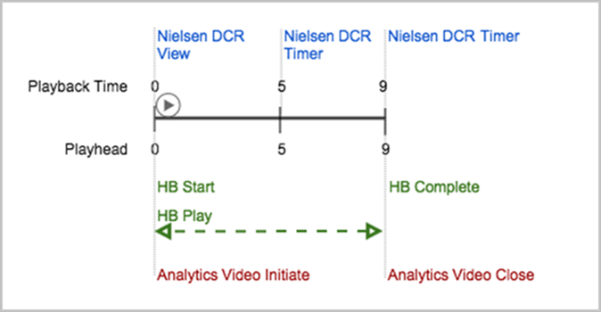
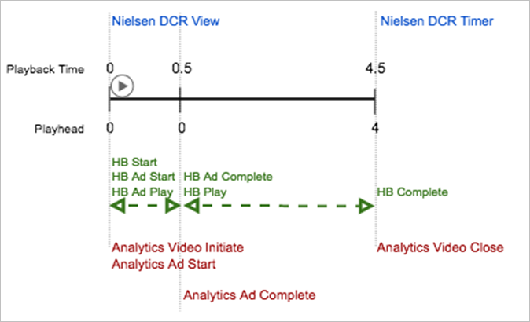
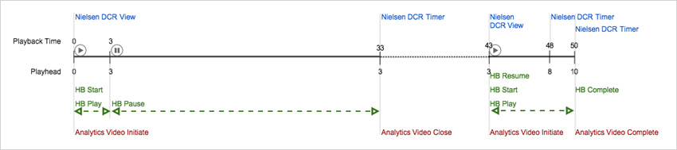

# Implementation Examples

This section contains the following information: 

* [ Sample Playback ](../../nielsen-partnership/c_dcr_implementation/c_dcr_tracking-examples.md#section_AB8950B9B2024031A8E633ED772FF176)
* [ Pre-Roll Ad Tracking ](../../nielsen-partnership/c_dcr_implementation/c_dcr_tracking-examples.md#section_FAF97F50A7F2468B9FCFFEC69AD504E1)
* [ Long Pause Tracking ](../../nielsen-partnership/c_dcr_implementation/c_dcr_tracking-examples.md#section_F89F30713B8A4BC8BEC932FCFBF061D3)

## Simple Playback {#section_AB8950B9B2024031A8E633ED772FF176}

In this scenario, playback is started for content that is 9 minutes long. 

  

**Expected events** 
* Nielsen DCR 
    * A ` timer` event is fired after the playhead is updated.
    * A ` timer` event is fired after the content is complete.

* Adobe Analytics 
    * An ` Analytics video initiate` event is fired after the session starts.
    * A main ` Heartbeat start` event is fired after the session starts.
    * Main ` Heartbeat play` events are filed every 10 seconds, starting with the first frame that is rendered.
    * A ` view` event is generated after the first play event is sent, in the first second of playback.
    * A main ` Heartbeat complete` event is fired after the content is completed.
    * A ` complete` video call sent to Analytics after the session ends.

**Expected metrics** 
* Nielsen 
    * 1 impression, and content that is 9 minutes long.

* Analytics 
    * 1 content start and 9 minutes of total time spent.

## Pre-roll Ad Tracking {#section_FAF97F50A7F2468B9FCFFEC69AD504E1}

In this scenario, playback starts for content that has 1 pre-roll ad that is 30 seconds, and the content is 4 minutes long. 

  

**Expected events** 
* Nielsen DCR 
    * A ` timer` event is fired after the playhead is updated.
    * A ` timer` event is fired after the content is complete.

* Adobe Analytics 
    * An ` Analytics video initiate` event is fired after the session starts.
    * An ` Analytics ad start` event is fired after the ad starts.
    * A ` Heartbeat ad play` event is fired every 10 seconds during ad.
    * A ` Ad Heartbeat complete` event is fired after the ad is completed.
    * Main ` Heartbeat play` events are fired every 10 seconds, starting with the first frame that is rendered.
    * A ` view` event is generated after the first play event is sent, in the first second of playback.
    * The main ` Heartbeat complete` event is fired after the content is complete.
    * A ` complete video` call sent to Analytics after a session has ended.

>[!IMPORTANT]
>
>In the 1.5x version of the library, to ensure proper continued video content measurement, you need to nullify the ad info object after an ad pod is completed.

## Long Pause Tracking {#section_F89F30713B8A4BC8BEC932FCFBF061D3}

In this scenario, playback is started for a content that is 10 minutes long. The playback is paused after 3 minutes, and pl after 40 minutes and play the content to the end. 

  

**Expected events** 
* Nielsen DCR 
    * A ` timer` event is fired after the session is closed after 30 minutes of pause.
    * A ` view` event is fired after a new session starts when playback resumes after being paused.
    * A ` timer` event is fired every 5 minutes of playback.
    * A ` timer` event is fired after the content is complete.

* Adobe Analytics 
    * An ` Analytics video initiate` event is fired after the session starts.
    * A ` Heartbeat start` event is fired after the session starts.
    * Main ` Heartbeat play` events are fired every 10 seconds, starting with the first frame that is rendered.
    * A ` view` event is generated when the first play event is sent (in the first second of playback)
    * ` Heartbeat pause` events are fired every 10 seconds during the pause for 30 minutes.
    * A ` close video` call sent to Analytics once the session has ended.
    * No Heartbeat event is fired for 10 minutes until playback resumes.
    * An ` Analytics video initiate` event is fired when a new tracking session starts, after which the playback resumes (including a new SID).
    * A ` Heartbeat start` event is fired after the session starts and playback resumes.
    * A ` Heartbeat resume` event is fired after the session starts and playback resumes.
    * ` Heartbeat play` events are fired every 10 seconds.
    * A ` Heartbeat complete` event is fired after the playback is complete.
    * A ` complete video` call is sent to Analytics after a session has ended.

* **Expected metrics** 
    * Nielsen     
        * 1 impression and 3 minutes of duration;
        * 1 impression and 7 minutes of duration.

    * Anaytics     
        * 1 content start and 3 minutes of total time spent;
        * 1 content start and 7 minutes of total time spent;

