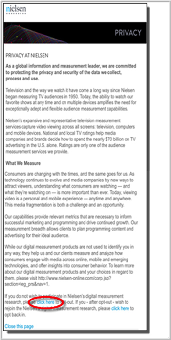
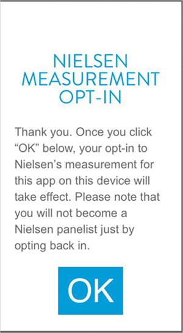
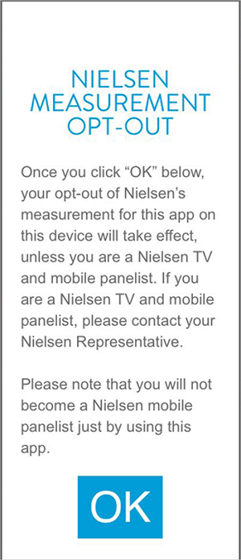

# Opt-Out Implementation


* [ About Opting Out ](../../../nielsen-partnership/c_dcr_implementation/opt-out/opt-out.md#section_1AC37A86F3C54C44AFA5E3BDD4192342)
* [ Opt-Out Data Flows ](../../../nielsen-partnership/c_dcr_implementation/opt-out/opt-out.md#section_1A8636424EDB49ABB458C2FDFD92F158)
* [ Opt-out Verbiage Sample ](../../../nielsen-partnership/c_dcr_implementation/opt-out/opt-out.md#section_D3049339CDD94E7993FF9D636ED13AE8)
* [ Align Opt-Out for Mobile Devices ](../../../nielsen-partnership/c_dcr_implementation/opt-out/opt-out.md#section_9E9205F2A94F4053A3B816B52B289190)
* [ Separate Opt-Out for Mobile Devices ](../../../nielsen-partnership/c_dcr_implementation/opt-out/opt-out.md#section_2C58B717C2BE405283D47DF5F8C5FF19)
* [ Opt out of Nielsen Measurement on Mobile ](../../../nielsen-partnership/c_dcr_implementation/opt-out/opt-out.md#section_DE6D61B94E864621863E81841B92B7AC)
* [ Opt-Out Implementation Checks for Nielsen ](../../../nielsen-partnership/c_dcr_implementation/opt-out/opt-out.md#section_168762ADC87440FDBA9FDD4F7D1E5DE0)


## About Opting Out {#section_1AC37A86F3C54C44AFA5E3BDD4192342}

You can opt out of Nielsen on the following types of content: 
* **Browser Content** For browser content (both video and static) a Nielsen opt-out is global. This means that opting out of Nielsen measurement on one site opts the user out of Nielsen measurement on all sites. Adobe’s opt-out is specific to the data collection domain. Because the scope of these two opt out options vary, the options are kept separate and are managed independently of each another. 

* **Mobile Content** For mobile content (both video and static), the Nielsen opt-out is limited to the app in which it is implemented. This is the same scope of an Adobe opt-out, thus it is technically feasible to align the two opt-outs if desired. 


Adobe and Nielsen recommend that you align the opt-outs on mobile devices so that when users opt out of Nielsen, they are also opted out of Adobe and vice versa. 

Consider the following benefits and drawbacks when making the decision: 
* **Benefits** 
    * Differences in opted-out users will not cause variance between [!DNL  Adobe Analytics] numbers and Nielsen DCR ratings.
    * DCR demographic ratings are scaled to an Adobe volumetric count that share the same collection methodology.
    * The merged Adobe/Nielsen data set will be eligible for syndication after syndication is available.
    * If opt-out is not aligned, the Nielsen DCR numbers will not be eligible for syndication because Nielsen demographics will be scaled to an Adobe number that includes users who opted out of Nielsen. This situation is temporary, with a resolution targeted for later this year, after which your Nielsen DCR numbers will be eligible for syndication.

* **Drawbacks** 
    * You will collect less data in [!DNL  Adobe Analytics], and possibly create trend breaks, because Nielsen average opt-out rates are higher than Adobe opt-out rates.
    * Because there is no legal or contractual requirement to offer for an Adobe opt-out, you might have to add Adobe opt-out to your app, which reduces the amount of data that you collect.


## Opt-Out Data Flows {#section_1A8636424EDB49ABB458C2FDFD92F158}

The opt-out data flows are different for Adobe and Nielsen and are also different for browser and mobile. 

<table id="table_97A2A34351AC4992A54638D81551971F"> 
 <thead> 
  <tr> 
   <th colname="col1" class="entry"> </th> 
   <th colname="col2" align="center" class="entry"> Mobile </th> 
   <th colname="col3" align="center" class="entry"> Browser </th> 
  </tr> 
 </thead>
 <tbody> 
  <tr> 
   <td colname="col1"> <b>Adobe</b> </td> 
   <td colname="col2"> <p>The Mobile Services SDK has a setting that contain the opt-out status. After the user has expressed this preference, the app developer can set mobile content to be opted-out. Now, no additional data is transmitted from the device. </p> <p>App developers can determine whether they want to offer an opt-out to the end user and to set the appropriate settings in the SDK. </p> </td> 
   <td colname="col3"> <p>Opt-out can be offered as a link. When the end user clicks this link, an opt-out cookie is set on the data collection domain. </p> </td> 
  </tr> 
  <tr> 
   <td colname="col1"> <b>Nielsen</b> </td> 
   <td colname="col2"> <p>To opt out of Nielsen, you need to load a specific Nielsen URL in a web view in your app. </p> <p>Users read this page, and if they decide to opt out, this decision needs to be conveyed to the app. The app developer takes the necessary action. For more information, see <i>Opt out of Nielsen Measurement on Mobile</i> below. </p> </td> 
   <td colname="col3"> <p>Opt-out must be offered to the end user as a link. When users click the link, they are taken to a Nielsen page with more information about Nielsen data collection, and where the users can opt out. </p> <p>If the user decides to opt out, an opt-out cookie is set for Nielsen data collection and is global for all web properties that are measured with Nielsen in that web browser. </p> </td> 
  </tr> 
 </tbody> 
</table>


## Opt-out Verbiage Sample {#section_D3049339CDD94E7993FF9D636ED13AE8}

After you click **[!UICONTROL  OK]** below, your opt-out of Nielsen's measurement for this app on this device will take effect, unless you are a Nielsen TV and mobile panelist. Nielsen will, however, record your decision to opt-out of Nielsen's measurement for this app so that aggregated totals of opt-out figures can be calculated and recorded and will also include the generic delivery of content in its overall counts. If you are a Nielsen TV and mobile panelist, contact your Nielsen Representative. 

## Align Opt-out for Mobile Devices {#section_9E9205F2A94F4053A3B816B52B289190}

If you align your Adobe and Nielsen opt-outs on mobile devices, this information helps you understand the implementation. 


* **Mobile Static** Mobile static measurement relies on Adobe’s Mobile Services SDK, so by default, the two opt-outs are aligned. To offer an opt-out, you need to complete the additional steps below. 

* **Mobile Video** Mobile video measurement relies on Adobe’s Mobile Services SDK and Nielsen’s SDK. 

  >[!TIP]
  >
  >To opt-out of Nielsen, a Nielsen web page is loaded in a web view in the app.
  To align the opt-outs, the app developer must complete the following steps: 

    1. Set the Adobe SDK opt-out setting appropriately, which terminates Adobe data collection.
    1. Call the Nielsen opt-out function that is exposed by Adobe’s Nielsen SDK Plugin. When a user selects to opt-out, a ` goodbye` ping is fired off to the Nielsen server. For example:     
       ```
       https://secure-dcr-cert.imrwor ldwide.com/cgi-bin/cfg?cfgv=200&amp;longitude=&amp;latitude=&amp;apid=<yourappid>&amp;apv=01.00.00&amp;apn=Nielsen%2520sample&amp;sdkv=aa.4.0.0&amp;bldv=aa.4.0.0.4&amp;nuid=00b5926fea1807638ebfe6f04af6a455c5d9b2a1ed3e39f550f44daa39d0886d&amp;osver=ANDROID.4.4.4&amp;devtypid=samsung-SAMSUNG-SM-N910A&amp;devid=42ec6a26b000ccd34015ba8625ee29cd283190a8c00f1622f356e900bb5b2a23&amp;enc=true&amp;tz=-14400&amp;fmt=json&amp;adf=&amp;uoo=true&amp;sfcode=dcr-cert&amp;ccode=&amp;dma=539&amp;rnd=1434632964945
       ```


       When a user selects to opt back in, a ` hello` ping is fired off to the Nielsen server. For example:     
       ```
       https://secure-dcr-cert.imrworldwide.com/cgi-bin/cfg?cfgv=200&longitude=-82.65&latitude=28.05&apid 
       =<yourappid>&apv=01.00.00&apn=Nielsen%2520sample&sdkv=aa.4.0.0&bldv=aa.4.0.0.4&nuid=00b5 
       926fea1807638ebfe6f04af6a455c5d9b2a1ed3e39f550f44daa39d0886d&osver=ANDROID.4.4.4&devt 
       ypid=samsung-SAMSUNG-SM-N910A&devid=42ec6a26b000ccd34015ba8625ee29cd283190a8c00f1 
       622f356e900bb5b2a23&enc=true&tz=-14400&fmt=json&adf=&uoo=false&sfcode=dcr-cert&ccode=&d 
       ma=539&rnd=1434633027479 
       Separate opt-out for mobile devices
       ```


## Separate Opt-out for Mobile Devices {#section_2C58B717C2BE405283D47DF5F8C5FF19}

If you choose to separate your Adobe and Nielsen opt-outs on mobile devices, here is some information about the necessary implementation. 


* **Mobile Static** If you separate opt-out for mobile static, there are a few required steps: 

    1. An app developer must track the Nielsen opt-out status in a variable at the app level. The contents of this variable must be added to every single [!DNL  Analytics] call in a specific context data parameter. 
       <!-- Sample code and details are here. [ O R They? ] -->


    1. After implementing the Nielsen opt-out status in a variable and adding it as context data to all [!DNL  Analytics] calls, the app developer must log in to the [!DNL  Adobe Mobile Services] UI to configure the postbacks to fire only when the Nielsen opt-out parameter is not present. This step results in a ` goodbye` ping that is sent to Nielsen, which terminates Nielsen data collection. For more information, see [ Configure Postbacks ](https://marketing.adobe.com/resources/help/en_US/mobile/signals_.html). 


* **Mobile Video** Because the alignment of the opt-out requires extra steps for the app developer, separating the two opt-outs for mobile video involves not taking those extra steps. 

  The Nielsen opt-out process remains unchanged. After successfully completing the opt-out, the app developer should call the Nielsen opt-out function that is exposed by Adobe’s Nielsen SDK Plugin. In addition to the Nielsen opt-out process, the app developer might want to also offer an Adobe opt-out. 


## Opt out of Nielsen Measurement on Mobile {#section_DE6D61B94E864621863E81841B92B7AC}

To opt-out of Nielsen measurement, the user must have access to the *About Nielsen Measurement* page on the Nielsen website in the app settings screen. This page allows the user to opt-in and opt-out of Nielsen measurement. 

To enable the user's selection, the App SDK must be updated with the this opt-out flow: 

1. The user clicks the **[!UICONTROL  About Nielsen Measurement]** button or link.
1. The SDK requests the opt-out URL from the Joint Adobe/Nielsen SDK.
1. The Joint Adobe/Nielsen SDK returns the correct URL.
1. The application opens the URL in a web view in the app. 
   >[!IMPORTANT]
   >
   >This must be a web view, and the view cannot use an external browser outside the app.


1. User clicks **[!UICONTROL  Opt-in]** or **[!UICONTROL  Opt-out]**.  

   <a id="fig_7D5D396DD991438FB8C3BDE1F8105AA6"></a>  

   <a id="fig_249D7A2E7ADC4651BB534EC57F454D69"></a>  

1. The application captures the user selection and passes it back to the Joint Adobe/Nielsen SDK.
To view sample code to support this process, see one of the following topics: 

* [ Opt-Out Settings in Android ](../../../nielsen-partnership/c_dcr_implementation/opt-out/c_opt_android.md#concept_57B48DB95A494207A6C8527D75093924)
* [ Opt-out settings in iOS ](../../../nielsen-partnership/c_dcr_implementation/opt-out/c_opt_dcr_ios_1x.md#concept_576F2F64C769485FB3F2823219188BA4)
There is no API to opt out in JavaScript. For more information, see [ Opt-out settings in JavaScript ](../../../nielsen-partnership/c_dcr_implementation/opt-out/c_opt_dcr_js_1x.md#concept_6A4C2CA27DEC4472876893F6ED05FED1). 

## Opt-out Implementation Checks for Nielsen {#section_168762ADC87440FDBA9FDD4F7D1E5DE0}

You can test your opt-out implementation. 
1. Complete an opt-out in your app through the Nielsen opt-out webview.
1. When a user selects to opt-out, a ` goodbye` ping is fired off to the Nielsen server. For example: 
   ```
   https://secure-dcr-cert.imrworldwide.com/cgi-bin/cfg?cfgv=200&longitude=&latitude=&apid=<yourappi 
   d>&apv=01.00.00&apn=Nielsen%2520sample&sdkv=aa.4.0.0&bldv=aa.4.0.0.4&nuid=00b5926fea180 
   7638ebfe6f04af6a455c5d9b2a1ed3e39f550f44daa39d0886d&osver=ANDROID.4.4.4&devtypid=sams 
   ung-SAMSUNG-SM-N910A&devid=42ec6a26b000ccd34015ba8625ee29cd283190a8c00f1622f356e9 
   00bb5b2a23&enc=true&tz=-14400&fmt=json&adf=&uoo=true&sfcode=dcr-cert&ccode=&dma=539&rn 
   d=1434632964945
   ```


1. Watch the static or video content for at least three minutes. Pings will continue to fire if a user selects to opt-out. 

1. When a user selects to opt back in, a ` hello` ping is fired off to the Nielsen server. For example: 
   ```
   https://secure-dcr-cert.imrworldwide.com/cgi-bin/cfg?cfgv=200 
     &longitude=-82.65 
     &latitude=28.05 
     &apid=<yourappid> 
     &apv=01.00.00 
     &apn=Nielsen%2520sample 
     &sdkv=aa.4.0.0 
     &bldv=aa.4.0.0.4 
     &nuid=00b5926fea1807638ebfe6f04af6a455c5d9b2a1ed3e39f550f44daa39d0886d 
     &osver=ANDROID.4.4.4 
     &devtypid=samsung-SAMSUNG-SM-N910A 
     &devid=42ec6a26b000ccd34015ba8625ee29cd283190a8c00f1622f356e900bb5b2a23 
     &enc=true 
     &tz=-14400&
   ```


1. Watch video content for at least three minutes. There should be ` view` and ` duration` pings. 


