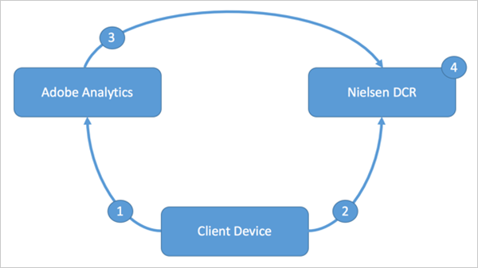

# Nielsen Partnership

## Overview {#section_244C951755DE4DBCB4EDCA0606B14BA1}

*Digital Content Ratings, Powered by Adobe* allows Media and Entertainment companies to combine the power of Adobe’s Experience Cloud with Nielsen’s television ratings to create ratings for digital content that is consumed on any device. 

Audiences are increasingly watching their favorite TV shows and movies where, when, and how they want. As a result, the industry must address key friction points to capitalize on these opportunities. When there are challenges of this scale, Adobe and its technologies take a leadership role in helping you to address these opportunities. 

Adobe, with its industry leadership, is partnering with Nielsen to deliver the first complete measurement solution for digital content. With Nielsen, Adobe addresses the vital need for cross-device, census-based content and audience measurement with demographics to make digital advertising more effective. This partnership combines Adobe's leadership in digital marketing, analytics, video delivery, and measurement with Nielsen's leadership in ratings and ad measurement. As a result of the partnership, Nielsen’s new solution, called *Digital Content Ratings, Powered by Adobe*, leverages Adobe Analytics as the basis for measurement. This ratings data is then made available across Nielsen and Adobe solutions for greater insight and action. 

This partnership aims to provide one source of measurement truth and provide the industry with broad, accurate, fast, and certified content and audience measurement on every screen. Adobe Experience Cloud customers can enhance content personalization, enable better video ad targeting, forecast audiences by demographics, and reduce wasted impressions. 

## Overview of the Data Flow {#section_306D5D7992C3426EB0FB8B626FE20843}

Here are four main data flows: 

 

1. Adobe collects data from the client device to provide the reporting that you see in Adobe Analytics. This step is standard Adobe Analytics data collection, but with Nielsen data elements appended so that Adobe and Nielsen data can be merged later. 

   >[!IMPORTANT]
   >
   >You must enable video tracking in Adobe Analytics.

1. Nielsen collects data from the client device to interact with third-party data providers that allow the providers to provide demographics and other data necessary to merge the Adobe and Nielsen data sets.
1. When a report suite is enabled for Nielsen data sharing, the necessary data in that report suite is added to a custom Data Warehouse feed that is sent securely from Adobe to Nielsen. The feed contains the quantitative (volumetric) data from Adobe Analytics.
1. Nielsen’s DCR platform merges the Nielsen data with the Adobe data, along with demographic data from third-party providers, to produce the Nielsen DCR ratings.
