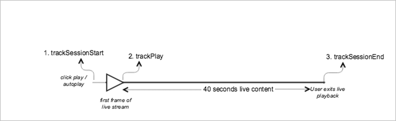

# Live content playback


><a id="fig_65D741D8180845E3BD58C248DD5083C6"></a>  

>
>* **Android - **Here is the expected API call order: >
>  ```
>  java>  // Set up mediaObject 
>  MediaObject mediaInfo = MediaHeartbeat.createMediaObject( 
>      Configuration.VIDEO_NAME,  
>      Configuration.VIDEO_ID,  
>      Configuration.VIDEO_LENGTH,  
>      MediaHeartbeat.StreamType.LIVE 
>  ); 
>   
>  HashMap<String, String> videoMetadata = new HashMap<String, String>(); 
>  videoMetadata.put(CUSTOM_VAL_1, CUSTOM_KEY_1); 
>  videoMetadata.put(CUSTOM_VAL_2, CUSTOM_KEY_2); 
>   
>  // 1. Call trackSessionStart() when the user clicks Play or if autoplay is used,  
>  //    i.e., there is an intent to start playback.  
>  _mediaHeartbeat.trackSessionStart(mediaInfo, videoMetadata); 
>   
>  ...... 
>  ...... 
>   
>  // 2. Call trackPlay() when the playback actually starts, i.e., when the first  
>  //    frame of main content is rendered on the screen. 
>  _mediaHeartbeat.trackPlay(); 
>   
>  ....... 
>  ....... 
>   
>  // 3. Call trackSessionEnd() when user ends the playback session.  
>  //    Since the user does not watch live video to completion, there  
>  //    is no need to call trackComplete().  
>  _mediaHeartbeat.trackSessionEnd(); 
>  ....... 
>  ....... 
>  
>  ```


>* **iOS - **Here is the expected API call order: >
>  ```
>  // Set up mediaObject 
>  ADBMediaObject *mediaObject =  
>    [ADBMediaHeartbeat createMediaObjectWithName:VIDEO_NAME  
>                       length:VIDEO_LENGTH  
>                       streamType:ADBMediaHeartbeatStreamTypeLIVE]; 
>     
>  NSMutableDictionary *videoContextData = [[NSMutableDictionary alloc] init]; 
>  [videoContextData setObject:CUSTOM_VAL_1 forKey:CUSTOM_KEY_1]; 
>  [videoContextData setObject:CUSTOM_VAL_2 forKey:CUSTOM_KEY_2]; 
>     
>  // 1. Call trackSessionStart when the user clicks Play or if autoplay is used,  
>  //    i.e., there is an intent to start playback. 
>  [_mediaHeartbeat trackSessionStart:mediaObject data:videoContextData]; 
>  ...... 
>  ...... 
>     
>  // 2. Call trackPlay when the playback actually starts, i.e., when the first  
>  //    frame of the main content is rendered on the screen. 
>  [_mediaHeartbeat trackPlay]; 
>  ....... 
>  ....... 
>     
>  // 3. Call trackSessionEnd when user ends the playback session. Since the user  
>  //    does not watch live video to completion, there is no need to call  
>  //    trackComplete. 
>  [_mediaHeartbeat trackSessionEnd]; 
>  ........ 
>  ........ 
>  
>  ```


>* **JavaScript - **Here is the expected API call order: >
>  ```
>  js>  // Set up mediaObject 
>  var mediaInfo =  
>    MediaHeartbeat.createMediaObject(Configuration.VIDEO_NAME,  
>                                     Configuration.VIDEO_ID,  
>                                     Configuration.VIDEO_LENGTH,  
>                                     MediaHeartbeat.StreamType.VOD); 
>   
>  var videoMetadata = { 
>      CUSTOM_KEY_1 : CUSTOM_VAL_1,  
>      CUSTOM_KEY_2 : CUSTOM_VAL_2,  
>      CUSTOM_KEY_3 : CUSTOM_VAL_3 
>  }; 
>   
>  // 1. Call trackSessionStart() when Play is clicked or if autoplay  
>  //    is used, i.e., there's an intent to start playback. 
>  this._mediaHeartbeat.trackSessionStart(mediaInfo, videoMetadata); 
>   
>  ...... 
>  ...... 
>   
>  // 2. Call trackPlay() when the playback actually starts, i.e., when the  
>  //    first frame of video is rendered on the screen. 
>  this._mediaHeartbeat.trackPlay(); 
>   
>  ....... 
>  ....... 
>   
>  // 3. Call trackSessionEnd() when user ends the playback session.  
>  //    Since user does not watch live video to completion, there is  
>  //    no need to call trackComplete(). 
>  this._mediaHeartbeat.trackSessionEnd(); 
>   
>  ........ 
>  ........ 
>  
>  ```


