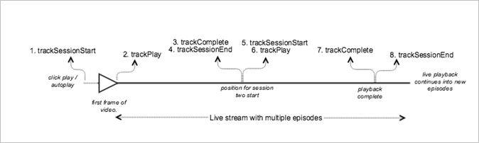

# Live main content with sequential tracking


><a id="fig_65D741D8180845E3BD58C248DD5083C6"></a>  

>
>* **Android - **Here is the expected API call order: >
>  ```
>  java>  // Set up mediaObject 
>  MediaObject mediaInfo = MediaHeartbeat.createMediaObject( 
>      Configuration.VIDEO_NAME,  
>      Configuration.VIDEO_ID,  
>      Configuration.VIDEO_LENGTH,  
>      MediaHeartbeat.StreamType.LIVE 
>  ); 
>   
>  HashMap<String, String> videoMetadata = new HashMap<String, String>(); 
>  videoMetadata.put(CUSTOM_VAL_1, CUSTOM_KEY_1); 
>  videoMetadata.put(CUSTOM_VAL_2, CUSTOM_KEY_2); 
>   
>  // 1. Call trackSessionStart() when the user clicks Play or if autoplay is used,  
>  //    i.e., when there is an intent to start playback.  
>  _mediaHeartbeat.trackSessionStart(mediaInfo, videoMetadata); 
>   
>  ...... 
>  ...... 
>   
>  // 2. Call trackPlay() when the playback actually starts, i.e., when the first  
>  //    frame of main content is rendered on the screen.  
>  _mediaHeartbeat.trackPlay(); 
>   
>  ....... 
>  ....... 
>   
>  // 3. Call trackComplete() when the playback reaches the end of session,  
>  //    i.e., when the video completes and finishes playing 1st episode/session.  
>  _mediaHeartbeat.trackComplete(); 
>   
>  ........ 
>  ........ 
>   
>  // 4. Call trackSessionEnd() to end session 1 
>  _mediaHeartbeat.trackSessionEnd(); 
>   
>  ........ 
>  ........ 
>   
>  // Start tracking session 2 /episode 2 of the same live stream.  
>  // There is no need to reinstantiate a mediaHeartbeat instance for tracking sesison 2. 
>  // Set up mediaObject 
>  MediaObject mediaInfo = MediaHeartbeat.createMediaObject( 
>      Configuration.VIDEO_NAME,  
>      Configuration.VIDEO_ID,  
>      Configuration.VIDEO_LENGTH,  
>      MediaHeartbeat.StreamType.LIVE 
>  ); 
>   
>  HashMap<String, String> videoMetadata = new HashMap<String, String>(); 
>  videoMetadata.put(CUSTOM_VAL_1, CUSTOM_KEY_1); 
>  videoMetadata.put(CUSTOM_VAL_2, CUSTOM_KEY_2); 
>   
>  // 5. Call trackSessionStart() when the playhead reaches a point that denotes the 
>  //    start of session 2 
>  _mediaHeartbeat.trackSessionStart(mediaInfo, videoMetadata); 
>   
>  ...... 
>  ...... 
>   
>  // 6. Call trackPlay() to start tracking session 2 playback  
>  _mediaHeartbeat.trackPlay(); 
>   
>  ....... 
>  ....... 
>   
>  // 7. Call trackComplete() when the playback reaches the end of session 2,  
>  //    i.e., the video completes and finishes playing.  
>  _mediaHeartbeat.trackComplete(); 
>   
>  ........ 
>  ........ 
>   
>  // 8. Call trackSessionEnd() to end session 2 
>  _mediaHeartbeat.trackSessionEnd(); 
>   
>  ........ 
>  ........ 
>   
>  // Continue similarly tracking further sessions in the live stream if required 
>  
>  ```


>* **iOS - **Here is the expected API call order: >
>  ```
>  // Set up mediaObject 
>  ADBMediaObject *mediaObject =  
>    [ADBMediaHeartbeat createMediaObjectWithName:VIDEO_NAME  
>                       length:VIDEO_LENGTH  
>                       streamType:ADBMediaHeartbeatStreamTypeLIVE]; 
>      
>  NSMutableDictionary *videoContextData = [[NSMutableDictionary alloc] init]; 
>  [videoContextData setObject:CUSTOM_VAL_1 forKey:CUSTOM_KEY_1]; 
>  [videoContextData setObject:CUSTOM_VAL_2 forKey:CUSTOM_KEY_2]; 
>      
>  // 1. Call trackSessionStart when the user clicks Play or if autoplay is used,  
>  //    i.e., there is an intent to start playback. 
>  [_mediaHeartbeat trackSessionStart:mediaObject data:videoContextData]; 
>  ...... 
>  ...... 
>      
>  // 2. Call trackPlay when the playback actually starts, i.e., when the first  
>  //    frame of main content is rendered on the screen. 
>  [_mediaHeartbeat trackPlay]; 
>  ....... 
>  ....... 
>    
>  // 3. Call trackComplete when the playback reaches the end of session,  
>  //    i.e., when the video completes and finishes playing the first 
>  //    episode/session. 
>  [_mediaHeartbeat trackComplete]; 
>  ....... 
>  ....... 
>    
>  // 4. Call trackSessionEnd to end session 1 
>  [_mediaHeartbeat trackSessionEnd]; 
>  ........ 
>  ........ 
>    
>  // Start tracking session 2 / episode 2 of the same live stream, No need to  
>  // reinstantiate mediaHeartbeat instance for tracking sesison 2. 
>   
>  // Set up mediaObject 
>  ADBMediaObject *mediaObject =  
>    [ADBMediaHeartbeat createMediaObjectWithName:VIDEO_NAME  
>                       length:VIDEO_LENGTH  
>                       streamType:ADBMediaHeartbeatStreamTypeLIVE]; 
>     
>  NSMutableDictionary *videoContextData = [[NSMutableDictionary alloc] init]; 
>  [videoContextData setObject:CUSTOM_VAL_1 forKey:CUSTOM_KEY_1]; 
>  [videoContextData setObject:CUSTOM_VAL_2 forKey:CUSTOM_KEY_2]; 
>     
>  // 5. Call trackSessionStart when the playhead reaches a point that denotes  
>  //    start of session 2 
>  [_mediaHeartbeat trackSessionStart:mediaObject data:videoContextData]; 
>  ...... 
>  ...... 
>     
>  // 6. Call trackPlay to start tracking session 2 playback 
>  [_mediaHeartbeat trackPlay]; 
>  ....... 
>  ....... 
>     
>  // 7. Call trackComplete when the playback reaches the end of session 2,  
>  //    i.e., when the video completes and finishes playing. 
>  [_mediaHeartbeat trackComplete]; 
>  ........ 
>  ........ 
>     
>  // 8. Call trackSessionEnd to end the session 2 
>  [_mediaHeartbeat trackSessionEnd]; 
>  ........ 
>  ........ 
>    
>  // Continue tracking further sessions in live stream similarly if required 
>  
>  ```


>* **JavaScript - **Here is the expected API call order: >
>  ```
>  js>  // Set up mediaObject 
>   
>  var mediaInfo = MediaHeartbeat.createMediaObject( 
>      Configuration.VIDEO_NAME,  
>      Configuration.VIDEO_ID,  
>      Configuration.VIDEO_LENGTH,  
>      MediaHeartbeat.StreamType.VOD 
>  ); 
>   
>  var videoMetadata = { 
>      CUSTOM_KEY_1 : CUSTOM_VAL_1,  
>      CUSTOM_KEY_2 : CUSTOM_VAL_2,  
>      CUSTOM_KEY_3 : CUSTOM_VAL_3 
>  }; 
>   
>  // 1. Call trackSessionStart() when Play is clicked or if autoplay is used,  
>  //    i.e., there's an intent to start playback. 
>  this._mediaHeartbeat.trackSessionStart(mediaInfo, videoMetadata); 
>   
>  ...... 
>  ...... 
>   
>  // 2. Call trackPlay() when the playback actually starts, i.e., when the  
>  //    first frame of video is rendered on the screen. 
>  this._mediaHeartbeat.trackPlay(); 
>   
>  ....... 
>  ....... 
>   
>  // 3. Call trackComplete() when the playback reaches the end of a session,  
>  //    i.e., whn playback completes and finishes playing the 1st episode/session. 
>  this._mediaHeartbeat.trackComplete(); 
>   
>  ........ 
>  ........ 
>   
>  // 4. Call trackSessionEnd() to end session 1 
>  this._mediaHeartbeat.trackSessionEnd(); 
>   
>  ........ 
>  ........ 
>   
>  // Start tracking session 2/episode 2 of the same live stream. There is no need  
>  // to reinstantiate a mediaHeartbeat instance for tracking sesison 2. 
>   
>  // Set up mediaObject 
>  var mediaInfo2 = MediaHeartbeat.createMediaObject( 
>      Configuration.VIDEO_NAME,  
>      Configuration.VIDEO_ID,  
>      Configuration.VIDEO_LENGTH,  
>      MediaHeartbeat.StreamType.LIVE 
>  ); 
>   
>  var videoMetadata2 = { 
>      CUSTOM_KEY_1 : CUSTOM_VAL_1,  
>      CUSTOM_KEY_2 : CUSTOM_VAL_2,  
>      CUSTOM_KEY_3 : CUSTOM_VAL_3 
>  }; 
>   
>  // 5. Call trackSessionStart() when the playhead reaches a point that denotes  
>  //    the start of session 2 
>  this._mediaHeartbeat.trackSessionStart(mediaInfo2, videoMetadata2); 
>   
>  ...... 
>  ...... 
>   
>  // 6. Call trackPlay() to start tracking session 2 playback 
>  this._mediaHeartbeat.trackPlay(); 
>   
>  ....... 
>  ....... 
>   
>  // 7. Call trackComplete() when the playback reaches the end of session 2,  
>  //    i.e., playback completes and finishes playing. 
>  this._mediaHeartbeat.trackComplete(); 
>   
>  ........ 
>  ........ 
>   
>  // 8. Call trackSessionEnd() to end session 2 
>  this._mediaHeartbeat.trackSessionEnd(); 
>   
>  ........ 
>  ........ 
>   
>  // Continue tracking further sessions in live stream similarly if required 
>  
>  ```


