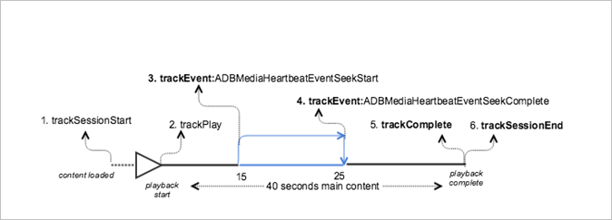

# Playback with seeking in the main content


><a id="fig_F8759D2BD8374E99AC2A90E57961FB0C"></a>  

>
>* **Android - **To view this scenario in Android, set up the following code: 

>
>  ```
>  java>  // Set up mediaObject 
>  MediaObject mediaInfo = MediaHeartbeat.createMediaObject( 
>      Configuration.VIDEO_NAME,  
>      Configuration.VIDEO_ID,  
>      Configuration.VIDEO_LENGTH,  
>      MediaHeartbeat.StreamType.VOD 
>  ); 
>   
>  HashMap<String, String> videoMetadata = new HashMap<String, String>(); 
>  videoMetadata.put(CUSTOM_KEY_1, CUSTOM_VAL_1); 
>  videoMetadata.put(CUSTOM_KEY_2, CUSTOM_VAL_2); 
>   
>  // 1. Call trackSessionStart() when the user clicks Play or if autoplay is used,  
>  //    i.e., there is an intent to start playback.  
>  _mediaHeartbeat.trackSessionStart(mediaInfo, videoMetadata); 
>   
>  ...... 
>  ...... 
>   
>  // 2. Call trackPlay() when the playback actually starts, i.e., whn the first frame  
>  //    of the main content is rendered on the screen.  
>  _mediaHeartbeat.trackPlay(); 
>   
>  ....... 
>  ....... 
>   
>  // 3. Track the MediaHeartbeat.Event.SeekStart event when the user begins to seek.  
>  _mediaHeartbeat.trackEvent(MediaHeartbeat.Event.SeekStart, null, null); 
>   
>  ....... 
>  ....... 
>   
>  // 4. Track the MediaHeartbeat.Event.SeekComplete event when the user completes seeking 
>  _mediaHeartbeat.trackEvent(MediaHeartbeat.Event.SeekComplete, null, null); 
>   
>  ....... 
>  ....... 
>   
>  // 5. Call trackComplete() when the playback reaches the end, i.e., when the video 
>  //    completes and finishes playing. 
>  _mediaHeartbeat.trackComplete(); 
>   
>  ........ 
>  ........ 
>   
>  // 6. Call trackSessionEnd() when the playback session is over. This method must be  
>  //    called even if the user does not watch the video to completion.  
>  _mediaHeartbeat.trackSessionEnd(); 
>   
>  ........ 
>  ........ 
>  
>  ```


>* **iOS - **To view this scenario in iOS, set up the following code: >
>  ```
>  // Set up mediaObject 
>  ADBMediaObject *mediaObject =  
>    [ADBMediaHeartbeat createMediaObjectWithName:VIDEO_NAME o 
>                       length:VIDEO_LENGTH  
>                       streamType:ADBMediaHeartbeatStreamTypeVOD]; 
>     
>  NSMutableDictionary *videoContextData = [[NSMutableDictionary alloc] init]; 
>  [videoContextData setObject:CUSTOM_VAL_1 forKey:CUSTOM_KEY_1]; 
>  [videoContextData setObject:CUSTOM_VAL_2 forKey:CUSTOM_KEY_2]; 
>    
>  // 1. Call trackSessionStart when the user clicks Play or if autoplay is used,  
>  //    i.e., there is an intent to start playback. 
>  [_mediaHeartbeat trackSessionStart:mediaObject data:videoContextData]; 
>  ....... 
>  ....... 
>    
>  // 2. Call trackPlay when the playback actually starts, i.e., when the 
>  //    first frame of the main content is rendered on the screen. 
>  [_mediaHeartbeat trackPlay];  
>  ....... 
>  ....... 
>   
>  // 3. Track the trackEvent:ADBMediaHeartbeatEventSeekStart event when the user  
>  //    begins to seek out of the chapter with the intent to skip it. 
>  [_mediaHeartbeat trackEvent:ADBMediaHeartbeatEventSeekStart  
>                   mediaObject:nil  
>                   data:nil]; 
>  ....... 
>  ....... 
>    
>  // 4. Track the trackEvent:ADBMediaHeartbeatEventSeekComplete event when the  
>  //    user seeks out of the chapter with the intent to skip it. 
>  [_mediaHeartbeat trackEvent:ADBMediaHeartbeatEventSeekComplete  
>                   mediaObject:nil  
>                   data:nil]; 
>  ....... 
>  ....... 
>    
>  // 5. Call trackComplete when the playback reaches the end, i.e., completes  
>  //    and finishes playing. 
>  [_mediaHeartbeat trackComplete]; 
>  ....... 
>  ....... 
>   
>  // 6. Call trackSessionEnd when the playback session is over. This method must  
>  //    be called even if the user does not watch the video to completion. 
>  [_mediaHeartbeat trackSessionEnd]; 
>  ....... 
>  ....... 
>  
>  ```


>* **JavaScript - **To view this scenario, enter the following text: >
>  ```
>  js>  // Set up mediaObject 
>  var mediaInfo = MediaHeartbeat.createMediaObject( 
>      Configuration.VIDEO_NAME,  
>      Configuration.VIDEO_ID,  
>      Configuration.VIDEO_LENGTH,  
>      MediaHeartbeat.StreamType.VOD 
>   
>  ); 
>   
>  var videoMetadata = { 
>      CUSTOM_KEY_1 : CUSTOM_VAL_1,  
>      CUSTOM_KEY_2 : CUSTOM_VAL_2,  
>      CUSTOM_KEY_3 : CUSTOM_VAL_3 
>   
>  }; 
>   
>  // 1. Call trackSessionStart() when Play is clicked or if autoplay is used,  
>  //    i.e., there's an intent to start playback. 
>  this._mediaHeartbeat.trackSessionStart(mediaInfo, videoMetadata); 
>   
>  ...... 
>  ...... 
>   
>  // 2. Call trackPlay() when the playback actually starts, i.e., when the  
>  //    first frame of the ad video is rendered on the screen. 
>  this._mediaHeartbeat.trackPlay(); 
>   
>  ....... 
>  ....... 
>   
>  // 3. Track the MediaHeartbeat.Event.SeekStart event when the user  
>  //    begins to seek. 
>  this._mediaHeartbeat.trackEvent(MediaHeartbeat.Event.SeekStart); 
>   
>  ....... 
>  ....... 
>   
>  // 4. Track the MediaHeartbeat.Event.SeekComplete event when the user  
>  //    completes seeking. 
>  this._mediaHeartbeat.trackEvent(MediaHeartbeat.Event.SeekComplete); 
>   
>  ....... 
>  ....... 
>   
>  // 5. Call trackComplete() when the playback reaches the end, i.e., when 
>  //    playback completes and finishes playing. 
>  this._mediaHeartbeat.trackComplete(); 
>   
>  ........ 
>  ........ 
>   
>  // 6. Call trackSessionEnd() when the playback session is over. This method must be called  
>  //    even if the user does not watch the video to completion. 
>  this._mediaHeartbeat.trackSessionEnd(); 
>   
>  ........ 
>  ........ 
>  
>  ```


