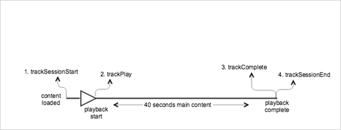

# Playback with no interruptions

<a id="fig_AB77956465F440B98D3990A56751F766"></a>  


* **Android - **To view this scenario in Android, set up the following code: 


  ```
  java  // Set up  mediaObject 
  MediaObject mediaInfo = MediaHeartbeat.createMediaObject( 
      Configuration.VIDEO_NAME,  
      Configuration.VIDEO_ID,  
      Configuration.VIDEO_LENGTH,  
      MediaHeartbeat.StreamType.VOD 
  ); 
   
  HashMap<String, String> videoMetadata = new HashMap<String, String>(); 
  videoMetadata.put(CUSTOM_VAL_1, CUSTOM_KEY_1); 
  videoMetadata.put(CUSTOM_VAL_2, CUSTOM_KEY_2); 
   
  // 1. Call trackSessionStart() when the user clicks Play or if autoplay  
  //    is used, i.e., there's an intent to start playback.  
  _mediaHeartbeat.trackSessionStart(mediaInfo, videoMetadata); 
   
  ...... 
  ...... 
   
  // 2. Call trackPlay() when the playback actually starts,  
  //    i.e., the first frame of video is rendered on the screen.  
  _mediaHeartbeat.trackPlay(); 
   
  ....... 
  ....... 
   
  // 3. Call trackComplete() when the playback reaches the end,  
  //    i.e., when the video completes and finishes playing.  
  _mediaHeartbeat.trackComplete(); 
   
  ........ 
  ........ 
   
  // 4. Call trackSessionEnd() when the playback session is over.  
  //    This method must be called even if the user does not watch  
  //    the video to completion.  
  _mediaHeartbeat.trackSessionEnd(); 
   
  ........ 
  ........ 
  
  ```


* **iOS - **To view this scenario in iOS, set up the following code: 
  ```
  when the user clicks Play 
  ADBMediaObject *mediaObject =  
    [ADBMediaHeartbeat createMediaObjectWithName:VIDEO_NAME  
                       length:VIDEO_LENGTH  
                       streamType:ADBMediaHeartbeatStreamTypeVOD]; 
    
  NSMutableDictionary *videoContextData = [[NSMutableDictionary alloc] init]; 
  [videoContextData setObject:CUSTOM_VAL_1 forKey:CUSTOM_KEY_1]; 
  [videoContextData setObject:CUSTOM_VAL_2 forKey:CUSTOM_KEY_2]; 
    
  // 1. Call trackSessionStart when the user clicks Play or if autoplay is used,  
  //    i.e., there's an intent to start playback. 
  [_mediaHeartbeat trackSessionStart:mediaObject data:videoContextData]; 
  ...... 
  ...... 
    
  // 2. Call trackPlay when the playback actually starts, i.e., when the  
  //    first frame of main content is rendered on the screen. 
  [_mediaHeartbeat trackPlay]; 
  ....... 
  ....... 
    
  // 3. Call trackComplete when the playback reaches the end, i.e.,  
  //    when the video completes and finishes playing. 
  [_mediaHeartbeat trackComplete]; 
  ........ 
  ........ 
    
  // 4. Call trackSessionEnd when the playback session is over. This method  
  //    must be called even if the user does not watch the video to completion. 
  [_mediaHeartbeat trackSessionEnd]; 
  ........ 
  ........ 
  
  ```


* **JavaScript - **To view this scenario in JavaScript, enter the following text: 
  ```
  js  // Set up mediaObject 
   
  var mediaInfo = MediaHeartbeat.createMediaObject(Configuration.VIDEO_NAME, Configuration.VIDEO_ID,  
  Configuration.VIDEO_LENGTH,MediaHeartbeat.StreamType.VOD); 
  var videoMetadata = { 
      CUSTOM_KEY_1 : CUSTOM_VAL_1,  
      CUSTOM_KEY_2 : CUSTOM_VAL_2,  
      CUSTOM_KEY_3 : CUSTOM_VAL_3 
   
  }; 
   
  // 1. Call trackSessionStart() when the user clicks play, or when autoplay is used,  
  //    i.e., there's an intent to start playback. 
  this._mediaHeartbeat.trackSessionStart(mediaInfo, videoMetadata); 
   
  ...... 
  ...... 
   
  // 2. Call trackPlay() when the main content starts, i.e.,  
  //    the first frame of the video content is rendered on the screen. 
  this._mediaHeartbeat.trackPlay(); 
   
  ....... 
  ....... 
   
  // 3. Call trackComplete() when the playback reaches the end,  
        i.e., the video completes and finishes playing. 
  this._mediaHeartbeat.trackComplete(); 
   
  ........ 
  ........ 
   
  // 4. Call trackSessionEnd() when the playback session is over.  
  //    This method must be called even if the user does not  
  //    watch the video to completion. 
  this._mediaHeartbeat.trackSessionEnd(); 
   
  ........ 
  ........
  ```


