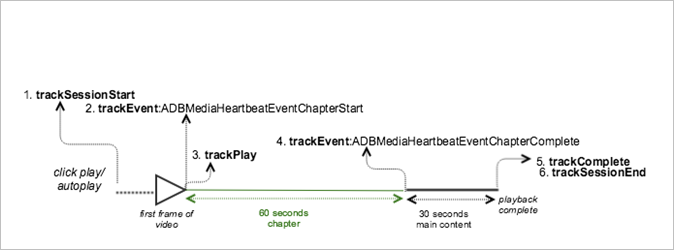

# Playback with one chapter at the beginning


><a id="fig_4EB77B19F72A4AF5A1209A773E7929E8"></a>  

>
>* **Android - **To view this scenario in Android, set up the following code: 

>
>  ```
>  java>  // Set up mediaObject 
>  MediaObject mediaInfo = MediaHeartbeat.createMediaObject( 
>      Configuration.VIDEO_NAME,  
>      Configuration.VIDEO_ID,  
>      Configuration.VIDEO_LENGTH,  
>      MediaHeartbeat.StreamType.VOD 
>  ); 
>   
>  HashMap<String, String> videoMetadata = new HashMap<String, String>(); 
>  videoMetadata.put(CUSTOM_KEY_1, CUSTOM_VAL_1); 
>  videoMetadata.put(CUSTOM_KEY_2, CUSTOM_VAL_2); 
>   
>  // 1. Call trackSessionStart() when the user clicks Play or if autoplay is used,  
>  //    i.e., there is an intent to start playback.  
>  _mediaHeartbeat.trackSessionStart(mediaInfo, videoMetadata); 
>   
>  ...... 
>  ...... 
>   
>  // 2. Call trackPlay() when the playback actually starts, i.e., first frame of the  
>  //    main content is rendered on the screen. 
>  _mediaHeartbeat.trackPlay(); 
>   
>  ....... 
>  ....... 
>   
>  // Chapter 
>  HashMap<String, String> chapterMetadata = new HashMap<String, String>(); 
>  chapterMetadata.put(CUSTOM_KEY_1, CUSTOM_VAL_1); 
>  MediaObject chapterDataInfo =  
>    MediaHeartbeat.createChapterObject(CHAPTER_NAME,  
>                                       CHAPTER_POSITION,  
>                                       CHAPTER_LENGTH,  
>                                       CHAPTER_START_TIME); 
>   
>  // 3. Track the MediaHeartbeat.Event.ChapterStart event when the chapter starts to play.  
>  _mediaHeartbeat.trackEvent(MediaHeartbeat.Event.ChapterStart, chapterDataInfo, chapterMetadata); 
>   
>  ....... 
>  ....... 
>   
>  // 4. Track the MediaHeartbeat.Event.ChapterComplete event when the chapter finishes playing. 
>  _mediaHeartbeat.trackEvent(MediaHeartbeat.Event.ChapterComplete, null, null); 
>   
>  ....... 
>  ....... 
>   
>  // 5. Call trackComplete() when the playback reaches the end, i.e., when the video completes  
>  //    and finishes playing. 
>  _mediaHeartbeat.trackComplete(); 
>   
>  ........ 
>  ........ 
>   
>  // 6. Call trackSessionEnd() when the playback session is over. This method must be called even  
>  //    if the user does not watch the video to completion.  
>  _mediaHeartbeat.trackSessionEnd(); 
>   
>  ........ 
>  ........ 
>  
>  ```


>* **iOS - **To view this scenario in iOS, set up the following code: >
>  ```
>  when the user clicks Play 
>  ADBMediaObject *mediaObject =  
>    [ADBMediaHeartbeat createMediaObjectWithName:VIDEO_NAME  
>                       length:VIDEO_LENGTH  
>                       streamType:ADBMediaHeartbeatStreamTypeVOD]; 
>     
>  NSMutableDictionary *videoContextData = [[NSMutableDictionary alloc] init]; 
>  [videoContextData setObject:CUSTOM_VAL_1 forKey:CUSTOM_KEY_1]; 
>  [videoContextData setObject:CUSTOM_VAL_2 forKey:CUSTOM_KEY_2]; 
>    
>  // 1. Call trackSessionStart when the user clicks Play or if autoplay is used,  
>  //    i.e., there is an intent to start playback. 
>  [_mediaHeartbeat trackSessionStart:mediaObject data:videoContextData]; 
>  ....... 
>  ....... 
>    
>  // Chapter 
>  NSMutableDictionary *chapterContextData = [[NSMutableDictionary alloc] init]; 
>  [chapterContextData setObject:CONTEXT_DATA_VALUE forKey:CONTEXT_DATA_KEY]; 
>    
>  id chapterInfo =  
>    [ADBMediaHeartbeat createChapterObjectWithName:CHAPTER_NAME  
>                       position:CHAPTER_POSITION  
>                       length:CHAPTER_LENGTH  
>                       startTime:CHAPTER_START_TIME]; 
>        
>  // 2. Call ADBMediaHeartbeatEventChapterStart when the chapter starts. 
>  [_mediaHeartbeat trackEvent:ADBMediaHeartbeatEventChapterStart  
>                   mediaObject:chapterInfo  
>                   data:chapterContextData]; 
>  ....... 
>  ....... 
>   
>  // 3. Call trackPlay when the playback actually starts, i.e., when the 
>  //    first frame of the main content is rendered on the screen. 
>  [_mediaHeartbeat trackPlay];  
>  ....... 
>  ....... 
>    
>  // 4. Call ADBMediaHeartbeatEventChapterComplete when the chapter starts. 
>  [_mediaHeartbeat trackEvent:ADBMediaHeartbeatEventChapterComplete  
>                   mediaObject:nil  
>                   data:nil];  
>  ....... 
>  ....... 
>    
>  // 5. Call trackComplete when the playback reaches the end, i.e., when the 
>  //    video completes and finishes playing. 
>  [_mediaHeartbeat trackComplete]; 
>  ....... 
>  ....... 
>   
>  // 6. Call trackSessionEnd when the playback session is over. This method  
>  //    must be called even if the user does not watch the video to completion. 
>  [_mediaHeartbeat trackSessionEnd]; 
>  ....... 
>  ....... 
>  
>  ```


>* **JavaScript - **To view this scenario in JavaScript, enter the following text: >
>  ```
>  js>  // Set up mediaObject 
>  var mediaInfo = MediaHeartbeat.createMediaObject( 
>     Configuration.VIDEO_NAME,  
>     Configuration.VIDEO_ID,  
>     Configuration.VIDEO_LENGTH,  
>     MediaHeartbeat.StreamType.VOD 
>   
>  ); 
>   
>  var videoMetadata = { 
>      CUSTOM_KEY_1 : CUSTOM_VAL_1,  
>      CUSTOM_KEY_2 : CUSTOM_VAL_2,  
>      CUSTOM_KEY_3 : CUSTOM_VAL_3 
>  }; 
>   
>  // 1. Call trackSessionStart() when Play is clicked or if autoplay is used,  
>  //    i.e., when there's an intent to start playback. 
>  this._mediaHeartbeat.trackSessionStart(mediaInfo, videoMetadata); 
>   
>  ...... 
>  ...... 
>   
>  // Chapter 
>  var chapterMetadata = { 
>      CUSTOM_KEY_1 : CUSTOM_VAL_1 
>  }; 
>   
>  var chapterDataInfo =  
>    MediaHeartbeat.createChapterObject(CHAPTER_NAME,  
>                                       CHAPTER_POSITION,  
>                                       CHAPTER_LENGTH,  
>                                       CHAPTER_START_TIME); 
>   
>  // 2. Track the MediaHeartbeat.Event.ChapterStart event when the chapter starts to play. 
>  this._mediaHeartbeat.trackEvent(MediaHeartbeat.Event.ChapterStart,  
>                                  chapterDataInfo,  
>                                  chapterMetadata); 
>   
>  ....... 
>  ....... 
>   
>  // 3. Call trackPlay() when the playback actually starts, i.e., when the first  
>  //    frame of the main content is rendered on the screen. 
>  this._mediaHeartbeat.trackPlay(); 
>   
>  ....... 
>  ....... 
>   
>  // 4. Track the MediaHeartbeat.Event.ChapterComplete event when the chapter  
>  //    finishes playing. 
>  this._mediaHeartbeat.trackEvent(MediaHeartbeat.Event.ChapterComplete); 
>   
>  ....... 
>  ....... 
>   
>  // 5. Call trackComplete() when the playback reaches the end, i.e., when playback   
>  //    completes and finishes playing. 
>  this._mediaHeartbeat.trackComplete(); 
>   
>  ........ 
>  ........ 
>   
>  // 6. Call trackSessionEnd() when the playback session is over. This method must be  
>  //    called even if the user does not watch the video to completion. 
>  this._mediaHeartbeat.trackSessionEnd(); 
>   
>  ........ 
>  ........ 
>  
>  ```


