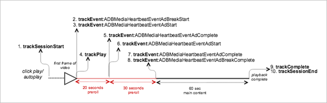

# Playback with a pre-roll ad break


><a id="fig_49C7C3412C3B413EABE67C39260F6C40"></a>  

>
>* **Android - **To view this scenario in Android, set up the following code: 

>
>  ```
>  java>  // Set up  mediaObject 
>  MediaObject mediaInfo = MediaHeartbeat.createMediaObject( 
>      Configuration.VIDEO_NAME,  
>      Configuration.VIDEO_ID,  
>      Configuration.VIDEO_LENGTH,  
>      MediaHeartbeat.StreamType.VOD 
>  ); 
>   
>  HashMap<String, String> videoMetadata = new HashMap<String, String>(); 
>  videoMetadata.put(CUSTOM_KEY_1, CUSTOM_VAL_1); 
>  videoMetadata.put(CUSTOM_KEY_2, CUSTOM_VAL_2); 
>   
>  // 1. Call trackSessionStart() when the user clicks Play or if autoplay is used,  
>  //    i.e., there's an intent to start playback.  
>  _mediaHeartbeat.trackSessionStart(mediaInfo, videoMetadata); 
>   
>  ...... 
>  ...... 
>   
>  // Pre-roll 
>  MediaObject adBreakInfo =  
>    MediaHeartbeat.createAdBreakObject(ADBREAK_NAME,  
>                                       ADBREAK_POSITION,  
>                                       ADBREAK_START_TIME); 
>  MediaObject adInfo =  
>    MediaHeartbeat.createAdObject(AD_NAME,  
>                                  AD_ID,  
>                                  AD_POSITION,  
>                                  AD_LENGTH); 
>   
>  // Context ad data 
>  HashMap<String, String> adMetadata = new HashMap<String, String>(); 
>  adMetadata.put(CUSTOM_KEY_1, CUSTOM_VAL_1); 
>  adMetadata.put(CUSTOM_KEY_2, CUSTOM_VAL_2); 
>   
>  // 2. Track the MediaHeartbeat.Event.AdBreakStart event when the pre-roll pod starts  
>  //    to play. Note that since this is a pre-roll, call must track the 
>  //    "MediaHeartbeat.Event.AdBreakStart" event before you call trackPlay().  
>  _mediaHeartbeat.trackEvent(MediaHeartbeat.Event.AdBreakStart, adBreakInfo, null); 
>   
>  ....... 
>  ....... 
>   
>  // 3. Track the MediaHeartbeat.Event.AdStart event when the pre-roll pod's ad starts  
>  //    to play. Note that since this is a pre-roll, you must track the  
>  //    "MediaHeartbeat.Event.AdStart" event before you call trackPlay(). 
>  _mediaHeartbeat.trackEvent(MediaHeartbeat.Event.AdStart, adInfo, adMetadata); 
>   
>  ....... 
>  ....... 
>   
>  // 4. Call trackPlay() when the playback actually starts, i.e., when the first frame  
>  //    of the ad video is rendered on the screen. 
>  _mediaHeartbeat.trackPlay(); 
>   
>  ....... 
>  ....... 
>   
>  // 5. Track the MediaHeartbeat.Event.AdComplete event when the ad reaches the end,  
>  //    i.e., when the ad completes and finishes playing.  
>  _mediaHeartbeat.trackEvent(MediaHeartbeat.Event.AdComplete, null, null); 
>   
>  ....... 
>  ....... 
>   
>  // 6. Track the MediaHeartbeat.Event.AdStart event when the pre-roll pod's second ad  
>  //    starts to play. 
>  _mediaHeartbeat.trackEvent(MediaHeartbeat.Event.AdStart, adInfo, adMetadata); 
>   
>  ....... 
>  ....... 
>   
>  // 7. Track the MediaHeartbeat.Event.AdComplete event when the second ad reaches the  
>  //    end, i.e., the second ad completes and finishes playing. 
>  _mediaHeartbeat.trackEvent(MediaHeartbeat.Event.AdComplete, null, null); 
>   
>  ....... 
>  ....... 
>   
>  // 8. Track the MediaHeartbeat.Event.AdBreakComplete event when all of the ads in the  
>  //    pod finish playing.  
>  _mediaHeartbeat.trackEvent(MediaHeartbeat.Event.AdBreakComplete, null, null); 
>   
>  ....... 
>  ....... 
>   
>  // 9. Call trackComplete() when the playback reaches the end, i.e., when the video 
>  //    completes and finishes playing. 
>  _mediaHeartbeat.trackComplete(); 
>   
>  ........ 
>  ........ 
>   
>  // 10. Call trackSessionEnd() when the playback session is over. This method must be  
>  //     called even if the user does not watch the video to completion.  
>  _mediaHeartbeat.trackSessionEnd(); 
>   
>  ........ 
>  ........ 
>  
>  ```


>* **iOS - **To view this scenario in iOS, set up the following code: >
>  ```
>  //  Set up mediaObject 
>  ADBMediaObject *mediaObject =  
>    [ADBMediaHeartbeat createMediaObjectWithName:VIDEO_NAME  
>                       length:VIDEO_LENGTH  
>                       streamType:ADBMediaHeartbeatStreamTypeVOD]; 
>      
>  NSMutableDictionary *videoContextData = [[NSMutableDictionary alloc] init]; 
>  [videoContextData setObject:CUSTOM_VAL_1 forKey:CUSTOM_KEY_1]; 
>  [videoContextData setObject:CUSTOM_VAL_2 forKey:CUSTOM_KEY_2]; 
>     
>  // 1. Call trackSessionStart when the user clicks Play or if autoplay is used,  
>  //    i.e., there is an intent to start playback. 
>  [_mediaHeartbeat trackSessionStart:mediaObject data:videoContextData]; 
>  ....... 
>  ....... 
>    
>  // Pre-roll 
>  ADBMediaObject *adBreakInfo =  
>    [ADBMediaHeartbeat createAdBreakObjectWithName:AD_BREAK_NAME  
>                       position:AD_BREAK_POSITION  
>                       startTime:AD_BREAK_START_TIME]; 
>  ADBMediaObject *adInfo =  
>    [ADBMediaHeartbeat createAdObjectWithName:AD_NAME  
>                       adId:AD_ID  
>                       position:AD_POSITION  
>                       length:AD_LENGTH]; 
>    
>  // context ad data 
>  NSMutableDictionary *adDictionary = [[NSMutableDictionary alloc] init]; 
>  [adDictionary setObject:@"custom-val1" forKey:@"custom-key1"]; 
>  [adDictionary setObject:@"custom-val2" forKey:@"custom-key2"]; 
>    
>  // 2. Track the ADBMediaHeartbeatEventAdBreakStart event when the pre-roll pod  
>  //    starts to play. Note that since this is a pre-roll, you must track the  
>  //    "ADBMediaHeartbeatEventAdBreakStart" event before you call trackPlay. 
>  [_mediaHeartbeat trackEvent:ADBMediaHeartbeatEventAdBreakStart  
>                   mediaObject:adBreakObject  
>                   data:nil]; 
>  ....... 
>  ....... 
>    
>  // 3. Track the ADBMediaHeartbeatEventAdStart event when the pre-roll pod's  
>  //    ad starts to play. Note that since this is a pre-roll, you must track  
>  //    the "ADBMediaHeartbeatEventAdStart" event before you call trackPlay. 
>  [_mediaHeartbeat trackEvent:ADBMediaHeartbeatEventAdStart  
>                   mediaObject:adObject  
>                   data:adDictionary]; 
>  ....... 
>  ....... 
>    
>  // 4. Call trackPlay when the playback actually starts, i.e., when the   
>  //    first frame of the main content is rendered on the screen. 
>  [_mediaHeartbeat trackPlay]; 
>  ....... 
>  ....... 
>    
>  // 5. Track the ADBMediaHeartbeatEventAdComplete event when the ad reaches  
>  //    the end, i.e., when the video completes and finishes playing. 
>  [_mediaHeartbeat trackEvent:ADBMediaHeartbeatEventAdComplete  
>                   mediaObject:nil  
>                   data:nil]; 
>  ....... 
>  ....... 
>    
>  // 6. Track the ADBMediaHeartbeatEventAdStart event when the pre-roll pod's  
>  //    second ad starts to play. 
>  [_mediaHeartbeat trackEvent:ADBMediaHeartbeatEventAdStart  
>                   mediaObject:adBreakObject  
>                   data:nil]; 
>  ....... 
>  ....... 
>    
>  // 7. Track the ADBMediaHeartbeatEventAdComplete event when the second ad  
>  //    reaches the end, i.e., it completes and finishes playing. 
>  [_mediaHeartbeat trackEvent:ADBMediaHeartbeatEventAdComplete  
>                   mediaObject:nil  
>                   data:nil]; 
>  ....... 
>  ....... 
>    
>  // 8. Track the ADBMediaHeartbeatEventAdBreakComplete event when all the  
>  //    ads in the pod finish playing. 
>  [_mediaHeartbeat trackEvent:ADBMediaHeartbeatEventAdBreakComplete  
>                   mediaObject:adBreakObject  
>                   data:nil]; 
>  ....... 
>  ....... 
>    
>  // 9. Call trackComplete when the playback reaches the end, i.e., when the  
>  //    video completes and finishes playing. 
>  [_mediaHeartbeat trackComplete]; 
>  ....... 
>  ....... 
>    
>  // 10. Call trackSessionEnd when the playback session is over. This method  
>  //     must be called even if the user does not watch the video to completion. 
>  [_mediaHeartbeat trackSessionEnd]; 
>  ....... 
>  ....... 
>  
>  ```


>* **JavaScript - **To view this scenario in JavaScript, enter the following text: >
>  ```
>  js>  // Set up mediaObject 
>  var mediaInfo =  
>    MediaHeartbeat.createMediaObject(Configuration.VIDEO_NAME,  
>                                     Configuration.VIDEO_ID,  
>                                     Configuration.VIDEO_LENGTH,MediaHeartbeat.StreamType.VOD); 
>  var videoMetadata = { 
>      CUSTOM_KEY_1 : CUSTOM_VAL_1,  
>      CUSTOM_KEY_2 : CUSTOM_VAL_2, 
>      CUSTOM_KEY_3 : CUSTOM_VAL_3 
>  }; 
>   
>  // 1. Call trackSessionStart() when Play is clicked or if autoplay is used,  
>  //    i.e., there's an intent to start playback. 
>  this._mediaHeartbeat.trackSessionStart(mediaInfo, videoMetadata); 
>   
>  ...... 
>  ...... 
>   
>  // Preroll 
>  var adBreakInfo =  
>    MediaHeartbeat.createAdBreakObject(ADBREAK_NAME, ADBREAK_POSITION, ADBREAK_START_TIME); 
>  var adInfo =  
>    MediaHeartbeat.createAdObject(AD_NAME, AD_ID, AD_POSITION, AD_LENGTH); 
>   
>  // Custom ad metadata 
>  var adMetadata = { 
>      CUSTOM_AD_KEY_1 : CUSTOM_AD_VAL_1,  
>      CUSTOM_AD_KEY_2 : CUSTOM_AD_VAL_2 
>  }; 
>   
>  // 2. Track the MediaHeartbeat.Event.AdBreakStart event when the preroll pod starts to play.  
>  //    Note that since this is a preroll, track the MediaHeartbeat.Event.AdBreakStart  
>  //    event before you call trackPlay(). 
>  this._mediaheartbeat.trackEvent(MediaHeartbeat.Event.AdBreakStart, adBreakInfo, null); 
>   
>  ....... 
>  ....... 
>   
>  // 3. Track the MediaHeartbeat.Event.AdStart event when the preroll pod's ad starts to play.  
>  //    Note that since this is a preroll, track the MediaHeartbeat.Event.AdStart event before  
>  //    you call trackPlay(). 
>  this._mediaheartbeat.trackEvent(MediaHeartbeat.Event.AdStart, adInfo, adMetadata); 
>   
>  ....... 
>  ....... 
>   
>  // 4. Call trackPlay() when the playback actually starts, i.e., the first frame of the  
>        main content is rendered on the screen.  
>  this._mediaHeartbeat.trackPlay(); 
>   
>  ....... 
>  ....... 
>   
>  // 5. Track event MediaHeartbeat.Event.AdComplete when the ad reaches the end,  
>  //    i.e., when it completes and finishes playing. 
>  this._mediaheartbeat.trackEvent(MediaHeartbeat.Event.AdComplete); 
>   
>  ....... 
>  ....... 
>   
>  // 6. Track the MediaHeartbeat.Event.AdStart event when the preroll pod's second  
>  //    ad starts to play. 
>  this._mediaheartbeat.trackEvent(MediaHeartbeat.Event.AdStart, adInfo, adMetadata); 
>   
>  ....... 
>  ....... 
>   
>  // 7. Track the MediaHeartbeat.Event.AdComplete event when the second ad reaches  
>  //    the end, i.e., when it completes and finishes playing. 
>  this._mediaheartbeat.trackEvent(MediaHeartbeat.Event.AdComplete); 
>   
>  ....... 
>  ....... 
>   
>  // 8. Track the MediaHeartbeat.Event.AdBreakComplete event when all the ads  
>  //    in the pod finish playing. 
>  this._mediaheartbeat.trackEvent(MediaHeartbeat.Event.AdBreakComplete); 
>   
>  ....... 
>  ....... 
>   
>  // 9. Call trackComplete() when the playback reaches the end, i.e., when it 
>  //    completes and finishes playing.  
>  this._mediaHeartbeat.trackComplete(); 
>   
>  // 10. Call trackSessionEnd() when the playback session is over. This method must  
>  //     be called even if the user does not watch the video to completion. 
>  this._mediaHeartbeat.trackSessionEnd(); 
>   
>  ....... 
>  .......
>  ```


