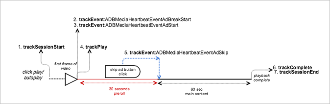

# Playback with skipped ads


<a id="section_2AE8066EB1F945E2B863EC0F2123E07D"></a>

<a id="fig_6DDC303ED9D14FE396EB093DF6E35882"></a>  


* **Android - **To view this scenario in Android, set up the following code: 


  ```
  java  // Set up mediaObject 
  MediaObject mediaInfo = MediaHeartbeat.createMediaObject( 
      Configuration.VIDEO_NAME,  
      Configuration.VIDEO_ID,  
      Configuration.VIDEO_LENGTH,  
      MediaHeartbeat.StreamType.VOD 
  ); 
   
  HashMap<String, String> videoMetadata = new HashMap<String, String>(); 
  videoMetadata.put(CUSTOM_KEY_1, CUSTOM_VAL_1); 
  videoMetadata.put(CUSTOM_KEY_2, CUSTOM_VAL_2); 
   
  // 1. Call trackSessionStart() when the user clicks Play or if autoplay is used,  
  //    i.e., there is an intent to start playback.  
  _mediaHeartbeat.trackSessionStart(mediaInfo, videoMetadata); 
   
  ...... 
  ...... 
   
  // Pre-roll 
  MediaObject adBreakInfo =  
    MediaHeartbeat.createAdBreakObject(ADBREAK_NAME,  
                                       ADBREAK_POSITION,  
                                       ADBREAK_START_TIME); 
  MediaObject adInfo =  
    MediaHeartbeat.createAdObject(AD_NAME,  
                                  AD_ID,  
                                  AD_POSITION,  
                                  AD_LENGTH); 
   
  // Context ad data 
  HashMap<String, String> adMetadata = new HashMap<String, String>(); 
  adMetadata.put(CUSTOM_KEY_1, CUSTOM_VAL_1); 
  adMetadata.put(CUSTOM_KEY_2, CUSTOM_VAL_2); 
   
  // 2. Track the MediaHeartbeat.Event.AdBreakStart event when the pre-roll pod starts to play.  
  //    Note that since this is a pre-roll, track the "MediaHeartbeat.Event.AdBreakStart"  
  //    event before you call trackPlay().  
  _mediaHeartbeat.trackEvent(MediaHeartbeat.Event.AdBreakStart, adBreakInfo, null); 
   
  ....... 
  ....... 
   
  // 3. Track the MediaHeartbeat.Event.AdStart event when the pre-roll pod's ad starts to play.  
  //    Note that since this is a pre-roll, track the "MediaHeartbeat.Event.AdStart" event  
  //    before you call trackPlay().  
  _mediaHeartbeat.trackEvent(MediaHeartbeat.Event.AdStart, adInfo, adMetadata); 
   
  ....... 
  ....... 
   
  // 4. Call trackPlay() when the playback actually starts, i.e. when the first frame of the  
  //    main content is rendered on the screen.  
  _mediaHeartbeat.trackPlay(); 
   
  ....... 
  ....... 
   
  // 5. Track the MediaHeartbeat.Event.AdSkip event when the user intends to and is able to 
  //    skip an ad.  For example, this could be tied to a "Skip Ad" button onClick handler.  
  //    The application could have the viewer land in main content post ad.  
  _mediaHeartbeat.trackEvent(MediaHeartbeat.Event.AdSkip, null, null); 
   
  ....... 
  ....... 
   
  // 6. Call trackComplete() when the playback reaches the end, i.e., when the video  
  //    completes and finishes playing.  
  _mediaHeartbeat.trackComplete(); 
   
  ........ 
  ........ 
   
  // 7. Call trackSessionEnd() when the playback session is over. This method must be called  
  //    even if the user does not watch the video to completion.  
  _mediaHeartbeat.trackSessionEnd(); 
   
  ........ 
  ........ 
  
  ```


* **iOS - **To view this scenario, enter the following text: 
  ```
  when the user clicks Play 
  ADBMediaObject *mediaObject =  
    [ADBMediaHeartbeat createMediaObjectWithName:VIDEO_NAME  
                       length:VIDEO_LENGTH  
                       streamType:ADBMediaHeartbeatStreamTypeVOD]; 
      
  NSMutableDictionary *videoContextData = [[NSMutableDictionary alloc] init]; 
  [videoContextData setObject:CUSTOM_VAL_1 forKey:CUSTOM_KEY_1]; 
  [videoContextData setObject:CUSTOM_VAL_2 forKey:CUSTOM_KEY_2]; 
     
  // 1. Call trackSessionStart when the user clicks Play or if autoplay is used,  
  //    i.e., there is an intent to start playback. 
  [_mediaHeartbeat trackSessionStart:mediaObject data:videoContextData]; 
  ....... 
  ....... 
    
  // Pre-roll 
  ADBMediaObject *adBreakInfo =  
    [ADBMediaHeartbeat createAdBreakObjectWithName:AD_BREAK_NAME  
                       position:AD_BREAK_POSITION  
                       startTime:AD_BREAK_START_TIME]; 
  ADBMediaObject *adInfo =  
    [ADBMediaHeartbeat createAdObjectWithName:AD_NAME  
                       adId:AD_ID  
                       position:AD_POSITION  
                       length:AD_LENGTH]; 
    
  // Context ad data 
  NSMutableDictionary *adDictionary = [[NSMutableDictionary alloc] init]; 
  [adDictionary setObject:@"custom-val1" forKey:@"custom-key1"]; 
  [adDictionary setObject:@"custom-val2" forKey:@"custom-key2"]; 
    
  // 2. Track the ADBMediaHeartbeatEventAdBreakStart event when the pre-roll pod  
  //    starts to play. Note that since this is a pre-roll, you must track the  
  //    ADBMediaHeartbeatEventAdBreakStart event before you call trackPlay. 
  [_mediaHeartbeat trackEvent:ADBMediaHeartbeatEventAdBreakStart  
                   mediaObject:adBreakObject  
                   data:nil]; 
  ....... 
  ....... 
   
  // 3. Track the ADBMediaHeartbeatEventAdStart event when the pre-roll pod's ad  
  //    starts to play. Note that since this is a pre-roll, track the  
  //    ADBMediaHeartbeatEventAdStart event before you call trackPlay. 
  [_mediaHeartbeat trackEvent:ADBMediaHeartbeatEventAdStart  
                   mediaObject:adObject  
                   data:adDictionary]; 
  ....... 
  ....... 
    
  // 4. Call trackPlay when the playback actually starts, i.e., when the first  
  //    frame of the main content is rendered on the screen. 
  [_mediaHeartbeat trackPlay]; 
  ....... 
  ....... 
    
  // 5. Track the ADBMediaHeartbeatEventAdSkip event when the user intends to  
  //    and is able to skip an ad. For example, this could be tied to a  
  //    "skip ad" button onClick handler. The application could have the viewer  
  //    land in main content post ad. 
  [_mediaHeartbeat trackEvent:ADBMediaHeartbeatEventAdSkip mediaObject:nil data:nil]; 
  ....... 
  ....... 
    
  // 6. Call trackComplete when the playback reaches the end, i.e., when the video 
  //    completes and finishes playing. 
  [_mediaHeartbeat trackComplete]; 
  ....... 
  ....... 
   
  // 7. Call trackSessionEnd when the playback session is over. This method must  
  //    be called even if the user does not watch the video to completion. 
  [_mediaHeartbeat trackSessionEnd]; 
  ....... 
  ....... 
  
  ```


* **JavaScript - **To view this scenario in JavaScript, enter the following text: 
  ```
  js  // Set up mediaObject 
  var mediaInfo =  
    MediaHeartbeat.createMediaObject(Configuration.VIDEO_NAME,  
                                     Configuration.VIDEO_ID,  
                                     Configuration.VIDEO_LENGTH,  
                                     MediaHeartbeat.StreamType.VOD); 
   
  var videoMetadata = { 
      CUSTOM_KEY_1 : CUSTOM_VAL_1,  
      CUSTOM_KEY_2 : CUSTOM_VAL_2,  
      CUSTOM_KEY_3 : CUSTOM_VAL_3 
  }; 
   
  // 1. Call trackSessionStart() when Play is clicked or if autoplay is used,  
  //    i.e., there's an intent to start playback. 
  this._mediaHeartbeat.trackSessionStart(mediaInfo, videoMetadata); 
   
  ...... 
  ...... 
   
  // Preroll 
  var adBreakInfo =  
    MediaHeartbeat.createAdBreakObject(ADBREAK_NAME,  
                                       ADBREAK_POSITION,  
                                       ADBREAK_START_TIME); 
  MediaObject adInfo =  
    MediaHeartbeat.createAdObject(AD_NAME,  
                                  AD_ID,  
                                  AD_POSITION,  
                                  AD_LENGTH); 
   
  //context ad data 
  var adMetadata = { 
      CUSTOM_KEY_1 : CUSTOM_VAL_1,  
      CUSTOM_KEY_2 : CUSTOM_VAL_2 
  }; 
   
  // 2. Track the MediaHeartbeat.Event.AdBreakStart event when the preroll pod starts to play.  
  //    Since this is a preroll, you must track the MediaHeartbeat.Event.AdBreakStart event  
  //    before calling trackPlay(). 
  this._mediaHeartbeat.trackEvent(MediaHeartbeat.Event.AdBreakStart, adBreakInfo); 
   
  ....... 
  ....... 
   
  // 3. Track the MediaHeartbeat.Event.AdStart event when the preroll pod's ad starts to play.  
  //    Since this is a preroll, you must track the MediaHeartbeat.Event.AdStart event before  
  //    calling trackPlay(). 
  this._mediaHeartbeat.trackEvent(MediaHeartbeat.Event.AdStart, adInfo, adMetadata); 
   
  ....... 
  ....... 
   
  // 4. Call trackPlay() when the playback actually starts, i.e., when the first frame of  
  //    the main content is rendered on the screen. 
  this._mediaHeartbeat.trackPlay(); 
   
  ....... 
  ....... 
   
  // 5. Track the MediaHeartbeat.Event.AdSkip event when the user intends to (and can)   
  //    skip the ad. For example, this could be tied to a "skip ad" button onClick handler.  
  //    The application could have the viewer land in the main content post ad. 
  this._mediaHeartbeat.trackEvent(MediaHeartbeat.Event.AdSkip); 
   
  ....... 
  ....... 
   
  // 6. Call trackComplete() when the playback reaches the end, i.e., playback completes  
  //    and finishes playing. 
  this._mediaHeartbeat.trackComplete(); 
   
  ........ 
  ........ 
   
  // 7. Call trackSessionEnd() when the playback session is over. This method must be called even  
  //    if the user does not watch the video to completion. 
  this._mediaHeartbeat.trackSessionEnd(); 
   
  ........ 
  ........ 
  
  ```


