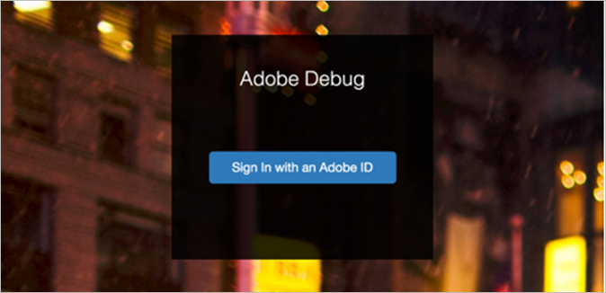
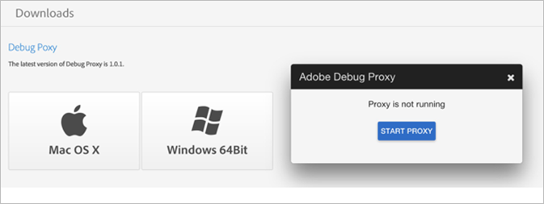

# Configure Adobe Debug

## Accessing Adobe Debug {#section_AF81E7AD331E41FFA371AB9DA924BFBB}

To access Adobe Debug: 

1. Go to [ www.marketing.adobe.com ](www.marketing.adobe.com) and create a new Adobe Experience Cloud user. 
   >[!TIP]
   >
   >This login is not the same username/password you use to log into Adobe Analytics.

1. After you have an Experience Cloud account, contact your Adobe representative to request access to Adobe Debug.
1. After access has been granted, go to [ https://debug.adobe.com ](https://debug.adobe.com) and use Experience Cloud credentials to log in.   

   The supported browsers for this tool are:

    * Google Chrome
    * Mozilla Firefox
    * Apple Safari
    * Microsoft Internet Explorer versions 9-11

The recommended browsers are the latest versions of Chrome and Firefox. 

## Debug Proxy {#section_8D3493B8426B46DEB9CD7E2ABD785D66}

**Download** 

To download and configure the Debug Proxy: 

1. Download the Debug Proxy app at [ App Downloads ](https://debug.adobe.com/#/downloads). The supported operating systems are: 

    * OS X 10.7 64-bit or higher
    * Windows 7.1 64-bit or higher

     

1. The Debug Proxy server will run on your local machine on port 33284 and will be set as the system proxy. You might need to adjust your browser setting based on the OS and the browser. 

## Download and Install the SSL Certificate on Desktop or Apps {#section_2F9547E301CB413299A67BD59AFBEE0D}

**SSL Support** 

The first time you run Adobe Debug, a unique SSL certificate will be generated. If you support HTTPS traffic across desktop and/or Apps, you need to download and install our SSL certificate. 

To download and install the SSL certificate: 

1. After Adobe Debug has been installed and started, go to [ http://proxy.debug.adobe.com/ssl ](http://proxy.debug.adobe.com/ssl) and download the certification.
1. Import the certificate. **Mac OS** 
    1. Double-click the root CA certificate to open it in Keychain Access.
    1. The root CA certificate appears in login.
    1. Move (drag) the root CA certificate to System.
    1. You must copy the certificate to System to ensure that it is trusted by all users and local system processes.
    1. Open the root CA certificate, expand Trust, select Always Trust, and save your changes.

   **Windows** 
    1. Complete one of the following procedures:     
        * [ Adding certificates to the Trusted Root Certification Authorities store for a local computer ](https://technet.microsoft.com/en-us/library/cc754841.aspx#BKMK_addlocal)
        * [ How To Import a Trusted Root Certification Authority In Windows 7/Vista/XP ](http://www.sqlservermart.com/HowTo/Windows_Import_Certificate.aspx) You might need to quit and reopen your browser to see the change. 

    1. For Firefox, complete the procedure in [ Installing root certificate in Mozilla Firefox ](https://wiki.wmtransfer.com/projects/webmoney/wiki/Installing_root_certificate_in_Mozilla_Firefox). You might need to quit and reopen Firefox to see the change. 

   **iOS Devices** 
    1. Set your iOS device to use Adobe Debug as its HTTP proxy by clicking **[!UICONTROL  Settings app]** **>** **[!UICONTROL  Wifi settings]**.
    1. In Safari, go to [ http://proxy.debug.adobe.com/ssl ](http://proxy.debug.adobe.com/ssl). Safari will prompt you to install the SSL certificate. 

## Install the SSL Certificate for your Mobile Device {#section_F2A3336F482C43E2ABEA742AD5CCACCA}

If you are missing the HTTPS calls in Adobe Debug, you must install the SSL Certificate for Adobe Debug on the mobile device. 

**iOS** 

To install the SSL certificate on an iOS device: 

1. On your laptop, turn on the Debug Proxy, and go to [ Adobe Debug ](https://debug.adobe.com).
1. Complete the following steps on your iOS device: 
    1. Turn your device to airplane mode.
    1. Select the same Wi-Fi signal that is used by your laptop.
    1. On your laptop, manually set the IP and port shown on the Debug Proxy app.
    1. Open an Apple Safari browser window.
    1. Go to [ http://proxy.debug.adobe.com/ssl ](http://proxy.debug.adobe.com/ssl).
    1. Download and install the SSL certificate.

1. On your laptop, start your Adobe Debug session.
1. Start testing on your iOS device.

**Android** 

To install the SSL certificate on an Android device: 

1. On your laptop turn on the Debug Proxy and go to [ Adobe Debug ](https://debug.adobe.com).
1. Complete the following steps on your Android device: 
    1. Set your device to Airplane Mode.
    1. Select the same Wi-Fi signal that is used by your laptop.
    1. On your laptop, manually set the IP and port shown on the Debug Proxy app.
    1. Open a browser window.
    1. Go to [ http://proxy.debug.adobe.com/ssl ](http://proxy.debug.adobe.com/ssl).
    1. Download and install the SSL certificate.

1. On your laptop, start your Adobe Debug session.
1. Start testing on your Android device.

