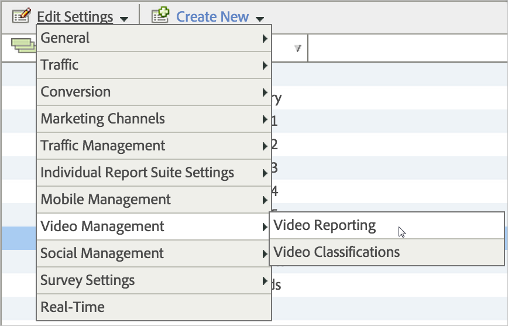

# Video Reports Enablement

Each report suite that collects video metrics must be configured before video data is sent. 

>[!TIP]
>
>To take advantage of new capabilities, existing Video Analytics customers should re-enable video tracking for their RSIDs.

1. In [ Reports & Analytics ](https://my.omniture.com/login/), click  **[!UICONTROL  Admin Tools]** > **[!UICONTROL  Report Suites]** .
1. Select the report suite(s) where you are collecting video data and click  **[!UICONTROL  Edit Settings]** > **[!UICONTROL  Video Management]** > **[!UICONTROL  Video Reporting]** .  

1. On the **[!UICONTROL  Video Reporting]** page, enable **[!UICONTROL  Video Core]**, and optionally enable **[!UICONTROL  Video Ads]**, **[!UICONTROL  Video Chapters]**, and **[!UICONTROL  Video Quality]**. Video measurement includes the following modules: 

    * **Video Core:** Core video measurement is used for video content. This will use Solution (or Custom) eVars to keep track of Content, Content Type, Content Player Name, and Content Channel. Solution (or Custom) events will be used for Video Initiates, Content Starts, Content Completes, and Content Time Spent.
    * **Video Ads:** Video ad measurement is used for the measurement of ads within the video content. This will use Solution eVvars to measure Ad, Ad Player Name, Ad Pod, and Ad in Pod Position. Solution events will be used for Ad Starts, Ad Completes, Ad Time Spent, and Video Time Spent.
    * **Video Chapters:** Video chapters measurement is used for the measurement of chapters. A chapter is a sub-division of content within a single video. This will use a Solution eVar to store the Chapter ID. Solution events will be used for Chapter Starts, Chapter Completes, and Chapter Time Spent. Additional chapter metadata of Chapter Name and Chapter Position will be provided as classifications of Chapter ID.
    * **Video Quality:** Video quality measurement is used for measuring the quality of the content playback. This will use Solution eVars to store Time to Start, Buffer Events, Total Buffer Duration, Bitrate Switches, Average Bitrate, Errors, and Dropped Frames. Solution events will be used for Time to Start, Drops before Start, Buffer Impacted Streams, Buffer Events, Total Buffer Duration, Bitrate Change Impacted Streams, Bitrate Changes, Avg Bitrate, Error Impacted Streams, Error Events, Dropped Frame Impacted Streams, and Dropped Frames.
   Enabling each module reserves a set of variables and creates a new set of reports. With the exception of Quality, there will be no data in reports unless the corresponding implementation has been completed. Implementing the Core module also implements the Quality module if you enable it. 

   If you are not yet tracking ads, chapters, or playback quality, you can enable additional options at any time. 

1. Click **[!UICONTROL  Save]**. If this report suite is already configured to collect video data, after you click **[!UICONTROL  Save]**, an additional configuration page is displayed. If you see the [!UICONTROL  Video Core Measurement] page, continue to the next step. 

1. (Conditional) On the [!UICONTROL  Video Core Measurement] page, select to continue using custom variables or to use solution variables. 
<table id="table_7F40EA3C30BC40AE9060E6FF0B7B96A1"> 
 <thead> 
  <tr> 
   <th colname="col1" class="entry"> Option </th> 
   <th colname="col2" class="entry"> Description </th> 
  </tr> 
 </thead>
 <tbody> 
  <tr> 
   <td colname="col1"> Continue using custom variables. </td> 
   <td colname="col2"> 
 
     <ul id="ul_93BB179CF28647A3921A010CADD9BC24"> 
      <li id="li_312933504ED54588B9759ECD6AAE0C07"><b>Pros:</b> Video trending continues to work after migration. </li> 
      <li id="li_86C63BE419DA4E159A3620C2CFAC72A0"><b>Cons:</b> Requires you to keep two custom eVars and three custom events allocated to video. You regain use of one custom eVar and one custom event. </li> 
     </ul>
 
 To continue using custom variables: 
     <ol id="ol_A1532DCC43F34F6B9D079C1BF9590B64"> 
      <li id="li_803BCBDDE7864D5891E881F6EF040B1B">Select  Use Custom Variables , then click  Save . </li> 
      <li id="li_32802086E31649338A2B8B08BEB2D76F">When prompted, map your current custom eVars and events and then click  Save : </li> 
     </ol>
 
 
     <fig id="fig_A7234D33D2524621B0065399772F9DF1">  
     </fig>
 </td> 
  </tr> 
  <tr> 
   <td colname="col1"> 
Migrate to solution variables. 
 
Note:  Migrating to solution variables causes you to lose <b>all</b> historical trending and comparison for video reports. 
 </td> 
   <td colname="col2"> 
 
     <ul id="ul_0973C12221724A5796166D52EBFCAED6"> 
      <li id="li_8788A51AF06748DAB86D15AF4E3975FC"><b>Pros:</b> You regain use of three custom eVars and four custom events. </li> 
      <li id="li_87DC22857D2046A5A3F12B48B35DD799"><b>Cons:</b> You lose <b>all</b> historical trending and comparison for video reports. This means that you cannot trend video views or video time played for any dates before you migrated to video heartbeat. </li> 
     </ul> 
Note:  Do not migrate to solution variables unless you are certain that you do not want to preserve this trending. 

 
All customers should use solution variables and processing rules to put video data into existing props and eVars, only if they need to preserve historical continuity. 
 
 To migrate to solution variables: 
     <ol id="ol_00FCF0BA5A644C87ADEA35BE81A985A5"> 
      <li id="li_CEC859EB367845A688D857581490D493">Select  Use Solution Variables  and click  Save . </li> 
     </ol>
 </td> 
  </tr> 
 </tbody> 
</table>

