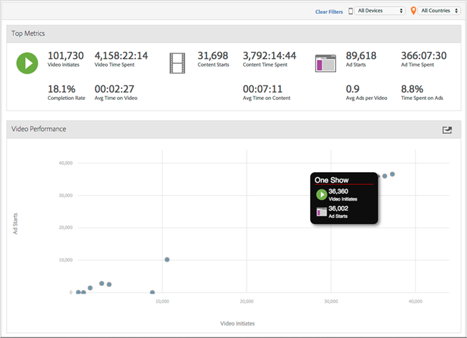
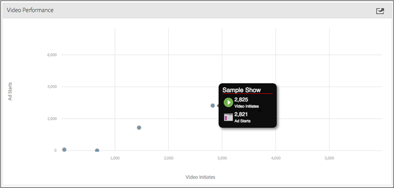

# Video Overview

The Video Overview display displays several aggregate measurements to quickly monitor that videos are performing as expected. A graph displays content starts next to ad starts to let you quickly view these metrics for each video. 
 
## Quick Filters {#section_8DF3E4A6734145B082657C6BECFA0BBE}

Quickly display video metrics by device or geo country: 
 
## Video Performance {#section_288FB476EDA44761BB8A86551F0A110C}

Click-and-drag to zoom in, then hover to view granular metrics for specific videos. Click   to reset the view after you zoom. 
 