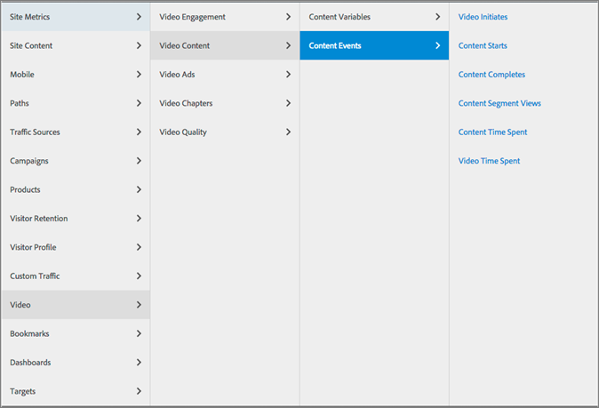

# Video Reports

Video variables and events are standard Analytics variables that can be reported directly and added to other Analytics reports. 

Video variables and events reports appear in the **[!UICONTROL  Video Content]**, **[!UICONTROL  Video Ads]**, **[!UICONTROL  Video Chapters]**, and **[!UICONTROL  Video Quality]** entries of the **[!UICONTROL  Video]** menu section. 

 
